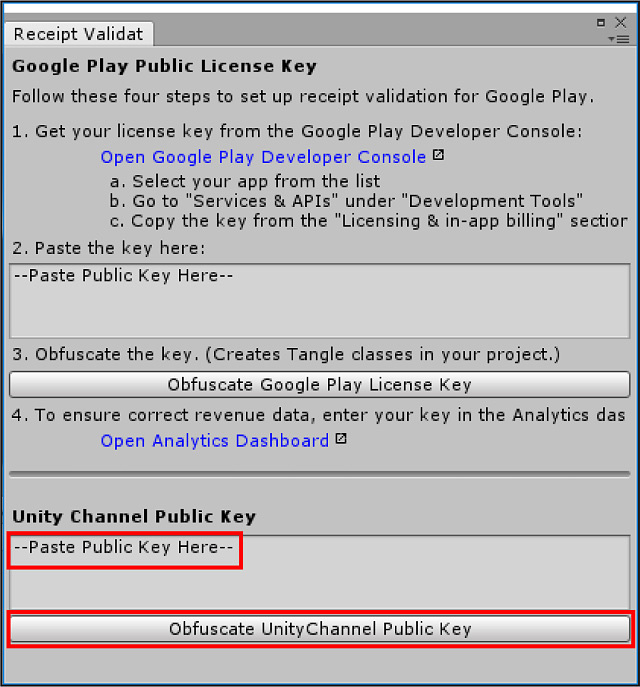

#Unity Channel SDK 和 API 扩展

##Unity Channel API
###UnityEngine.Store 命名空间
####AppInfo 类
`AppInfo` 类用于存储客户端到服务器通信和身份验证所需的客户端凭据和小米凭据。

| **键：**      | **类型：** | **描述：**       |
| :------------ | :--------- | :--------------- |
| **appID**     | string     | 小米 app ID      |
| **appKey**    | string     | 小米 app key     |
| **clientID**  | string     | Unity client ID  |
| **clientKey** | string     | Unity client key |
| **debug**     | bool       | 切换调试模式     |

####ILoginListener 接口
小米要求所有发布到 Mi Game Center 的应用程序通过 `ILoginListener` 进行登录。

| **键：**                                 | **类型：** | **描述：**       |
| :--------------------------------------- | :--------- | :--------------- |
| **OnInitialized ()**                     | void       | 初始化成功时调用 |
| **OnInitializedFailed (string message)** | void       | 初始化失败时调用 |
| **OnLogin ()**                           | void       | 登录成功时调用   |
| **OnLoginFailed (string message)**       | void       | 登录失败时调用   |

####StoreService 类
Unity IAP 在内部使用 `StoreService` 类对 Unity Channel SDK 进行初始化。

| **键：**                                                              | **类型：** | **描述：**               |
| :-------------------------------------------------------------------- | :--------- | :----------------------- |
| **static Initialize (AppInfo appInfo, ILoginListener loginListener)** | void       | 初始化 Unity Channel SDK |
| **static Login (AppInfo appInfo, ILoginListener loginListener)**      | void       | 登录小米帐户             |

####UserInfo 类
成功登录 Unity Channel 将会返回 `UserInfo` 类。返回的数据仅供参考。

| **键：**           | **类型：** | **描述：**                                                             |
| :----------------- | :--------- | :--------------------------------------------------------------------- |
| **channel**        | string     | Indicates which channel you are using (currently, it is only “XIAOMI”) |
| **userID**         | string     | Channel’s unique user ID                                               |
| **userLoginToken** | string     | 验证用户登录信息（请参阅小米 IAP 集成指南的“服务器端初始化”部分）      |

###UnityEngine.ChannelPurchase 命名空间
####IPurchaseListener 接口
Unity IAP 在内部使用 `IPurchaseListener` 接口来处理购买活动。

通过实现 `IPurchaseListener` 类来处理购买流程的状态：

```
using UnityEngine.ChannelPurchase;
......
private class ExamplePurchaseListener : IPurchaseListener{
    public void OnPurchase (PurchaseInfo purchaseInfo){
        Debug.Log ("Purchase Succeed: " + purchaseInfo.gameOrderId);
    }
    public void OnPurchaseFailed (string message, PurchaseInfo purchaseInfo){
        Debug.Log ("Purchase Failed: " + message);
    }
    public void OnPurchaseRepeated(string productCode){
        Debug.Log ("Purchase Repeated");
    }
    public void OnReceiptValidate (ReceiptInfo receiptInfo){
        Debug.Log ("Validate Succeed");
    }
    public void OnReceiptValidateFailed (string gameOrderId, string message){
        Debug.Log ("Validate Failed");
    }
    public void OnPurchaseConfirm (string gameOrderId){
        Debug.Log ("Confirm Succeed");
    }
    public void OnPurchaseConfirmFailed (string gameOrderId, string message){
        Debug.Log ("Confirm Failed");
    }
}
```

| **键：**                                                           | **类型：** | **描述：**                                         |
| :----------------------------------------------------------------- | :--------- | :------------------------------------------------- |
| **OnPurchase ()**                                                  | void       | 购买成功时调用                                     |
| **OnPurchaseFailed (string message, PurchaseInfo purchaseInfo)**   | void       | 购买失败时调用                                     |
| **OnPurchaseRepeated (string productCode)**                        | void       | 再次购买非消耗商品时调用                           |
| **OnReceiptValidation (ReceiptInfo receiptInfo)**                  | void       | `PurchaseService.ValidateReceipt (...)` 成功时调用 |
| **OnReceiptValidationFailed (string gameOrderID, string message)** | void       | `PurchaseService.ValidateReceipt (...)` 失败时调用 |
| **OnPurchaseConfirm (string gameOrderId)**                         | void       | 已弃用                                             |
| **OnPurchaseConfirm (string gameOrderId, string message)**         | void       | 已弃用                                             |

####PurchaseService 类
Unity IAP 在内部使用 `PurchaseService` 类来启动购买活动。

在实现购买监听器的情况下，调用 `PurchaseService.Purchase` 方法来执行购买交易：

```
using UnityEngine.ChannelPurchase;
......
    var myPurchaseListener = new ExamplePurchaseListener ();
    PurchaseService.Purchase ("Product ID", "Game Order ID", myPurchaseListener);
```

商品 ID (Product ID) 列在 Xiaomi Developer Portal 中。如果应用程序以调试模式运行，则商品 ID 也会导出到 _MiGameProductCatalog.prop_ 文件。游戏订单 ID (Game Order ID) 可以是 null；Unity Channel SDK 将生成其 UUID。

| **键：**                                                                                        | **类型：** | **描述：**                             |
| :---------------------------------------------------------------------------------------------- | :--------- | :------------------------------------- |
| **static Purchase (string productCode, string gameOrderId, IPurchaseListener productListener)** | void       | 购买商品                               |
| **static ValidateReceipt (string gameOrderId, IPurchaseListener purchaseListener)**             | void       | 验证购买                               |
| **static ConfirmPurchase ()**                                                                   | void       | 已弃用（改用 `ValidateReceipt (...)`） |

####PurchaseInfo 类
购买后，通过调用 `PurchaseService.ValidateReceipt` 方法来验证购买：

```
    PurchaseService.ValidateReceipt(gameOrderId, myPurchaseListener);
```

如果 `gameOrderId` 有效，则 `myPurchaseListener` 会接收包含 `signData` 和 `signature` 的 `ReceiptInfo`，而 Unity Channel 将使用这些信息来验证购买。

| **键：**            | **类型：** | **描述：**                                                                            |
| :------------------ | :--------- | :------------------------------------------------------------------------------------ |
| **productCode**     | string     | A Product’s unique ID (you can also configure this directly in the Xiaomi dev portal) |
| **gameOrderId**     | string     | The order’s purchase ID                                                               |
| **orderQueryToken** | string     | 用于验证购买                                                                          |

<a name="ReceiptInfo"></a>
####ReceiptInfo 类
验证工作通常在游戏服务器上进行，但是您也可以在客户端验证 `signData`。

| **键：**        | **类型：** | **描述：**                         |
| :-------------- | :--------- | :--------------------------------- |
| **gameOrderId** | string     | The order’s purchase ID            |
| **signData**    | string     | 一个包含购买详细信息的 JSON 字符串 |
| **signature**   | string     | signData’s signature               |

##收据验证和扩展 API
在继续之前，请查看有关 [Unity IAP 收据验证](https://docs.unity3d.com/Manual/UnityIAPValidatingReceipts.html)的文档。另请参阅 [UnityEngine.Purchasing Scripting API](https://docs.unity3d.com/ScriptReference/index.html)。

###UnityEngine.Purchasing 命名空间
`IUnityChannelConfiguration` 和 `IUnityChannelExtensions` 接口为拆解应用商店收据提供了扩展功能。

在购买时使用 Unity IAP `CrossPlatformValidator` 类（在[收据验证](https://docs.unity3d.com/Manual/UnityIAPValidatingReceipts.html)文档中有详细说明）和 `IUnityChannelExtensions.ValidateReceipt` 方法（在下文有详细说明）执行本地收据验证。

在实现验证之前，为小米启用收据混淆处理：

1. Obtain your app’s **Client RSA Public Key** from your App Store Settings (see the **App Store Settings** section of the [Xiaomi IAP integration guide](https://docs.unity3d.com/Manual/UnityIAPXiaomi.html)), or from the [Unity Client Settings dashboard](https://id.unity.com/en/user_clients/settings). 2.在 Unity Editor 的 Unity IAP Receipt Validation Obfuscator 窗口 (**Window** > **Unity IAP** > **Receipt Validation Obfuscator**) 中输入 Unity Channel 密钥。此窗口可收集、混淆处理和存储项目中的公钥以进行收据验证。 3.在 Receipt Validation Obfuscator 窗口中，选择 **Obfuscate Unity Channel Public Key** 以将生成的 _UnityChannelTangle_ 数据文件保存到项目中。



####IUnityChannelConfiguration 接口
To automatically fetch the required receipt data from Unity Channel during purchase, set `IUnityChannelConfiguration.fetchReceiptPayloadOnPurchase` to `true` when initializing Unity IAP. This calls `IUnityChannelExtensions.ValidateReceipt` internally after a successful purchase (ideally when the [`PurchaseEventArgs`](https://docs.unity3d.com/ScriptReference/Purchasing.PurchaseEventArgs.html)’ `purchasedProduct.receipt` field triggers the `IStoreListener.ProcessPurchase` success callback).

**注意**：如果将 `fetchReceiptPayloadOnPurchase` 标志设置为 true，则会产生一个网络请求来获取成功购买后的加密收据数据。如果这里的第二个网络请求由于任何原因而失败，那么 `ProcessPurchase` 成功回调会收到一个包含无效收据的商品。

通过 `CrossPlatformValidator.Validate` API 传递 `purchasedProduct.receipt` 数据将会返回一个 `IPurchaseReceipt`（这是经过完全验证的收据）。如果结果为空，则表示验证失败。请参阅以下示例：

```
CrossPlatformValidator validator = new CrossPlatformValidator (GooglePlayTangle.Data(), AppleTangle.Data(), UnityChannelTangle.Data(), Application.identifier);

var result = validator.Validate(purchasedProduct.receipt);
```

| **键：**                          | **类型：** | **描述：**                              |
| :-------------------------------- | :--------- | :-------------------------------------- |
| **fetchReceiptPayloadOnPurchase** | bool       | 购买期间自动收集 Unity Channel 收据数据 |

####IUnityChannelExtensions 接口
Use the `IUnityChannelExtensions` interface to confirm purchases and validate receipts. The callbacks for the above methods return a bool indicating success, a ‘signData’ string, and a ‘signature’ string (see section on [ChannelPurchase.ReceiptInfo](#ReceiptInfo)).

**注意**：`ValidateReceipt ()` 容易遭受[中间人攻击](https://en.wikipedia.org/wiki/Man-in-the-middle_attack)，因此请使用客户端 RSA 公钥 (Client RSA Public Key) 来增加安全性（请参阅[小米 IAP 集成指南](https://docs.unity3d.com/Manual/UnityIAPXiaomi.html)的**应用商店设置**部分）。

| **键：**                                                                             | **类型：** | **描述：**                                                                       |
| :----------------------------------------------------------------------------------- | :--------- | :------------------------------------------------------------------------------- |
| **`ConfirmPurchase (string transactionID, Action<bool, string, string>, callback)`** | void       | 收集先前购买的购买状态（用于查看购买历史记录，尤其是游戏中断或网络超时的情况下） |
| **`ValidateReceipt (string transactionID, Action<bool, string, string>, callback)`** | void       | 验证给定交易 ID (transactionID) 的收据                                           |

####UnifiedReceipt 类
`UnifiedReceipt` 类包含 Unity IAP 可以解释的特定于商店的交易数据。请参阅以下示例了解如何拆解一个统一收据字符串：

```
var unifiedReceipt = JsonUtility.FromJson<UnifiedReceipt>(purchEvtArg.purchasedProduct.receipt)
```

| **键：**          | **类型：** | **描述：**                                                                                |
| :---------------- | :--------- | :---------------------------------------------------------------------------------------- |
| **Payload**       | string     | Unity IAP’s wrapper for receipts that come back in different formats for different stores |
| **Store**         | string     | 发生购买的商店                                                                            |
| **TransactionID** | string     | 唯一的交易 ID                                                                             |

####UnityChannelPurchaseReceipt 接口
使用 `UnityChannelPurchaseReceipt` 可进一步将统一收据拆解为 Unity Channel 收据。请参阅以下示例：

```
var ucReceipt = JsonUtility.FromJson<UnityChannelPurchaseReceipt>(unifiedReceipt.Payload)
```

此额外的 Unity Channel 收据数据仅供参考。

| **键：**            | **类型：** | **描述：**          |
| :------------------ | :--------- | :------------------ |
| **productID**       | string     | 购买的商品的唯一 ID |
| **transactionID**   | string     | 唯一的交易 ID       |
| **orderQueryToken** | string     | 订单查询令牌        |

###运行时的商店标识
要在运行时检查小米应用商店是否是您游戏中的有效商店，请使用以下代码片段提供的布尔值：

```
var module = StandardPurchasingModule.Instance();
bool m_IsUnityChannelSelected =
    Application.platform == RuntimePlatform.Android &amp;&amp;
    module.androidStore == AndroidStore.XiaomiMiPay;
```
