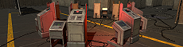
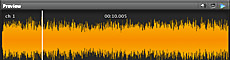
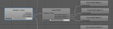
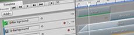

#Unity 用户手册 (2018.1)

使用 Unity Editor 可创建 2D 和 3D 游戏、应用程序和体验。请从 [unity3d.com](https://unity3d.com/unity) 下载 Editor。

Unity 用户手册可帮助您了解如何使用 Unity Editor 及其相关服务。您可以从头到尾阅读该手册，或将其用作参考。

如果这是第一次使用 Unity，请查看有关[使用 Unity](UnityOverview.html) 的介绍性文档，并观看 [Unity 教程](https://unity3d.com/learn/tutorials)。

 

**新增功能**

* 2018.1 引入的功能：[2018.1 中的新功能](WhatsNew20181.html)
* 从旧版 Unity 升级 Unity 项目：[升级指南](UpgradeGuides.html)

 

 

**最佳实践和专家指南**

* Unity 支持工程师总结的最佳实践：[最佳实践指南](BestPracticeGuides.html)
* Unity 开发人员用自己的语言创作的专家指南：[专家指南](ExpertGuides.html)

 

 

 

###Unity 用户手册的组成部分

###[在 Unity 中操作](UnityOverview.html)###
Unity Editor 的完整介绍。

 

###[Unity 2D](Unity2D.html)###
Unity Editor 的所有 2D 特定功能，包括游戏运行过程、精灵和物理系统。

###[图形](Graphics.html)###
Unity Editor 的视觉因素，包括摄像机和光照。

 

###[物理系统](PhysicsSection.html)###
Unity Editor 中的物理系统，包括刚体组件以及在 3D 空间中操作这些组件。

 
  

###[网络](UNet.html)###
如何实现玩家多人联网和网络。

 

###[脚本](ScriptingSection.html)###
使用 Unity Editor 中的脚本进行游戏编程。

 

###[音频](Audio.html)###
Unity Editor 中的音频，包括剪辑、音频源、监听器、导入和声音设置。

 

###[动画](AnimationSection.html)###
Unity Editor 中的动画。

 

###[时间轴](TimelineSection.html)###
Unity Editor 中的影片，包括过场动画和游戏序列。

 

###[UI](UISystem.html)###
Unity Editor 的 UI 系统。

 

###[导航](Navigation.html)###
Unity Editor 中的导航，包括 AI 和寻路。

 

###[Unity 服务](UnityServices.html)###

 

###[虚拟现实](VROverview.html)###

 

###[参与 Unity 开源项目](ContributingToUnity.html)###
就 Unity Editor 的某些源代码提供修改建议。

 

###[特定于平台的信息](PlatformSpecific.html)###
使用 Unity Editor 面向多种非桌面平台和 Web 平台进行项目开发时需要注意的特定信息。

 

###[旧版主题](LegacyTopics.html)###
如果要维护旧项目，可参考这些主题。

 

###其他信息源

* [Unity Answers](https://answers.unity3d.com/) 或 [Unity Forums](https://forum.unity3d.com/) - 在这里可以提问和搜索答案。

* [Unity 知识库](https://support.unity3d.com) - 向 Unity 支持团队提出的问题的答案集合。

* [教程](https://unity3d.com/learn/tutorials) - 关于使用 Unity Editor 的分步操作视频和书面指南。

* [Unity Ads Knowledge Base](https://unityads.unity3d.com/help/index) - 关于在游戏中添加广告的指南。

* [Everyplay 文档](https://developers.everyplay.com/documentation) - 关于 Everyplay 移动端游戏重播平台的指南。

* [Asset Store 帮助](https://unity3d.com/asset-store/help) - 关于 Asset Store 内容共享的帮助。

### 已知问题
该功能不能按预期工作？这可能是已知问题。请检查__问题跟踪系统 (Issue Tracker)__：[issuetracker.unity3d.com](https://issuetracker.unity3d.com)。
