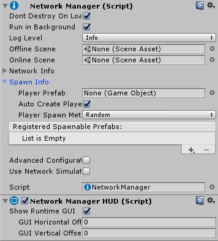
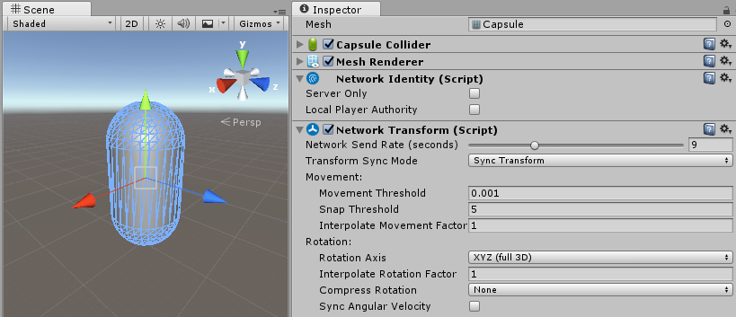
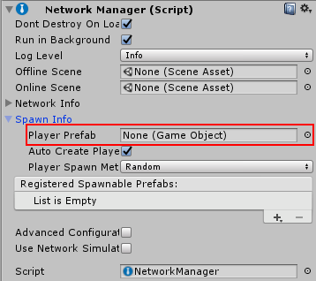
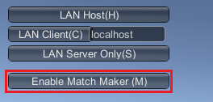
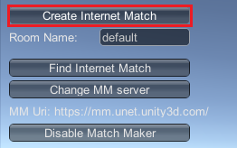
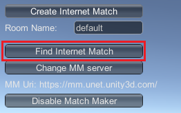
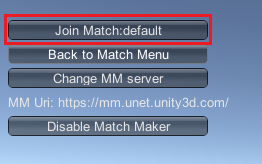

#使用 HUD 进行集成

要使用 __NetworkManagerHUD__ 来集成 Unity Multiplayer 服务，请遵循以下步骤：

1.在场景中创建一个空游戏对象。

2.向空游戏对象添加 __NetworkManager__ 和 __NetworkManagerHUD__ 组件。将此对象重命名为“Network Manager”以表明其用途。

     

3.创建一个预制件来表示玩家。连接到游戏的玩家将分别控制此预制件的某个实例。

4.向玩家预制件添加 __NetworkIdentity__ 和 __NetworkTransform__ 组件。__NetworkTransform__ 组件可同步玩家游戏对象的移动。如果要开发玩家不会移动的游戏，则不需要此组件。

     

5.在 Inspector 中，将玩家预制件添加到 __Network Manager__ 的 __Player Prefab__ 属性。

     

6.构建并运行项目。Network Manager HUD 将显示游戏内菜单。单击 __Enable Match Maker__。

     

7.在托管应用程序上选择一个房间名称并单击 __Create Internet Match__。

     

8.运行项目的更多实例，然后在这些客户端上单击 __Find Internet Match__。现在应该会显示房间名称。

     

9.单击 __Join Match__。玩家现在应该已经连接到同一个比赛。

     

