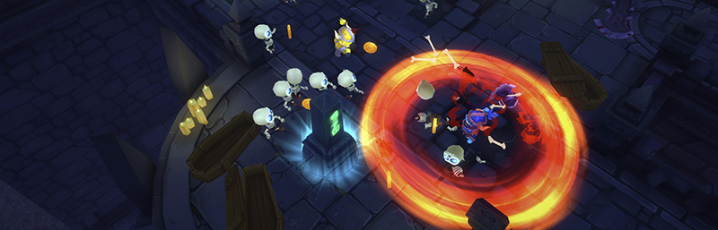

#Multiplayer 服务

 

在 Unity 中创建实时网络游戏最简单的方式就是使用 Multiplayer 服务。它实现方式快捷，而且支持高度自定义。Unity 提供的服务器和配对服务确保您的玩家可以轻松找到对方并一起玩游戏。

要详细了解如何使用 Unity Multiplayer 服务，请参阅 [Multiplayer 文档的 Services 部分](UnityMultiplayerSettingUp.html)。
