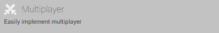
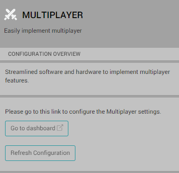
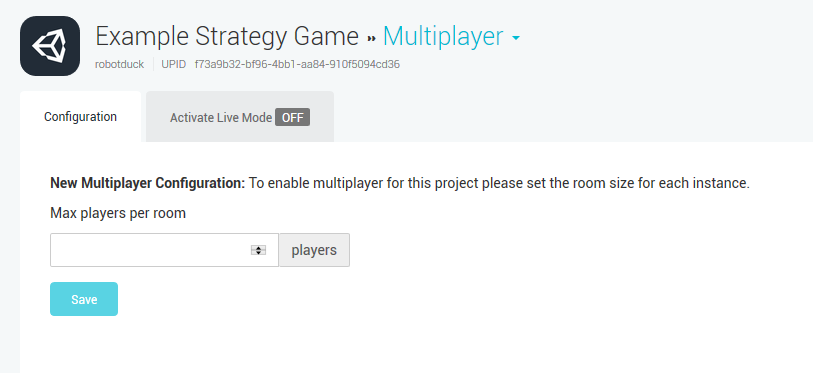
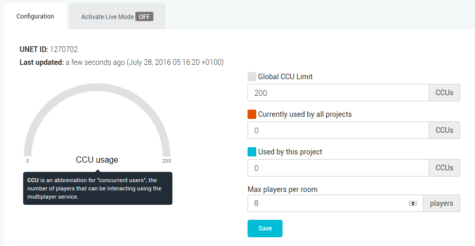

#设置 Unity Multiplayer

要开始使用 Unity Multiplayer，项目必须[设置为使用 Unity 服务](SettingUpProjectServices.html)。进行此设置后，即可启用 Multiplayer 服务。

为此，请在菜单栏中选择 __Window__ > __Services__ 来打开 __Services__ 窗口。在 Services 窗口中，选择 __Multiplayer__。

 

此时将打开 Multiplayer 服务窗口。

 

按 __Go To Dashboard__ 按钮将显示基于 Web 的 Services Dashboard，可在其中设置项目的 Multiplayer 配置。

如果还没有为项目设置 Multiplayer 服务，则会提示设置__新的多人游戏配置 (New Multiplayer Configuration)__。为此，请输入希望每个房间拥有的玩家数量，然后单击 __Save__。

 

单击 Save 后，Multiplayer Services Dashboard 将显示当前项目。

 

现在已经准备好将项目与 Unity Multiplayer 集成！

