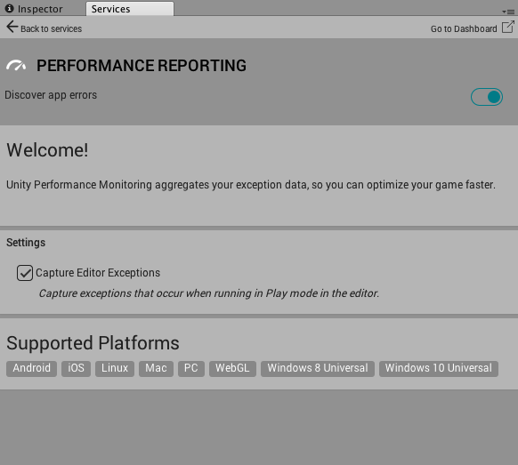
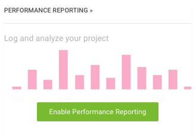

# Unity Performance Reporting

Unity Performance Reporting 可捕获并聚合异常数据和本机崩溃报告，从而帮助您了解运行时发生的情况并更快地优化项目。当游戏作为完整版本运行时以及在 Editor 中处于播放模式下时，异常会更新到 Services Dashboard。




有关启用 Performance Reporting 来跟踪崩溃（包括本机用户代码、引擎代码和插件中的崩溃）的信息，请参阅[设置 Performance Reporting](UnityPerformanceReportingSettingUp.html)。

## 本机崩溃报告可用性

本机崩溃报告可作为 [Unity Performance Reporting](https://unity3d.com/unity/features/performance-reporting) 服务的一部分供 Unity Plus 和 Pro 用户使用。

|**平台** |**可用起始版本** |
|:---|:---|
|iOS|5.6|
|Android|2017.2|
|MacOS|2017.3|
|Windows|2018.1|

## iOS 崩溃报告

使用 [IL2CPP](IL2CPP.html) 并将 [iOS Player Settings](class-PlayerSettingsiOS.html) __Script Call Optimization__ 设置设为 __Fast but no exceptions__ 时，iOS 崩溃报告会收集由于未捕获的托管异常而导致的崩溃。

有关 **Script Call Optimization** 设置的更多信息，请参阅 [iPhone 优化](iphone-iOS-Optimization.html)。

## 报告

报告会显示崩溃线程的本机堆栈跟踪。如果崩溃是由未捕获的托管异常引起的，则报告还会显示异常源自的托管堆栈跟踪以及本机堆栈跟踪。

请注意，iOS 崩溃报告无法收集应用程序内存不足而随后被操作系统关闭所导致的崩溃。

应通过 [Unity Cloud Developer Dashboard](http://developer.cloud.unity3d.com) 查看崩溃。此处，选择您的游戏并选择 __Enable Game Performance__（请参阅图 A）。



## 示例

下面的示例报告展示了由于托管异常而导致崩溃的类似报告：


```

Managed Stack Trace:

at CrashTests.CrashNextUpdate () [0x00000] in <filename unknown>:0

at CrashTests.Update () [0x00000] in <filename unknown>:0

Native StackTrace:

Thread 0 (crashed)

0 crashreporttest CrashedCheckBelowForHintsWhy() (CrashReporter.mm:106)

1 crashreporttest UnhandledExceptionEventHandler_Invoke_m689053609 (mscorlib_System_Delegate3660574010.h:79)

2 crashreporttest RuntimeInvoker_Void_t2779279689_Il2CppObject_Il2CppObject(MethodInfo const*, void*, void**) (Il2CppInvokerTable.cpp:405)

3 crashreporttest il2cpp::vm::Runtime::CallUnhandledExceptionDelegate(Il2CppDomain*, Il2CppDelegate*, Il2CppObject*) (Runtime.cpp:350)

4 crashreporttest il2cpp::vm::Runtime::UnhandledException(Il2CppObject*) (Runtime.cpp:440)

5 crashreporttest ScriptingInvocationNoArgs::Invoke(ScriptingException**) (ScriptingInvocationNoArgs.cpp:131)

6 crashreporttest ScriptingInvocationNoArgs::Invoke() (ScriptingInvocationNoArgs.cpp:95)

7 crashreporttest MonoBehaviour::CallUpdateMethod(int) (MonoBehaviour.cpp:541)

8 crashreporttest void BaseBehaviourManager::CommonUpdate<BehaviourManager>() (Behaviour.cpp:169)

9 crashreporttest PlayerLoop(bool, bool, IHookEvent*) (Player.cpp:1721)

10 crashreporttest UnityPlayerLoopImpl(bool) (LibEntryPoint.mm:240)

11 crashreporttest UnityRepaint (UnityAppController+Rendering.mm:238)

12 crashreporttest -[UnityAppController(Rendering) repaintDisplayLink] (UnityAppController+Rendering.mm:54)

13 QuartzCore CA::Display::DisplayLinkItem::dispatch()

14 QuartzCore CA::Display::DisplayLink::dispatch_items(unsigned long long, unsigned long long, unsigned long long)

15 IOKit IODispatchCalloutFromCFMessage

16 CoreFoundation __CFMachPortPerform

17 CoreFoundation __CFRUNLOOP_IS_CALLING_OUT_TO_A_SOURCE1_PERFORM_FUNCTION__

18 CoreFoundation __CFRunLoopDoSource1

19 CoreFoundation __CFRunLoopRun

20 CoreFoundation CFRunLoopRunSpecific

21 GraphicsServices GSEventRunModal

22 UIKit UIApplicationMain

23 crashreporttest main (main.mm:32)

```

* <span class="page-edit">2018-03-27  Page amended with limited [editorial review](DocumentationEditorialReview.html)
</span>
* <span class="page-history">在 Unity 5.5 中添加了 __Capture Editor Exceptions__ 设置并将 __Optimize game performance__ 开关标签重命名为 __Discover app errors__</span>
