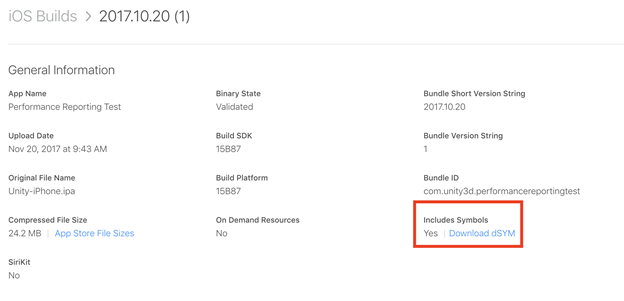

# 查找 iOS/OSX 应用程序符号和上传缺失的符号

使用 Xcode 编译应用程序时，iOS/OSX 会在名称如下所示的 dSYM 文件夹中放置符号：

_~/Library/Developer/Xcode/DerivedData/&lt;build id&gt;/Build/Products/&lt;build type&gt;/appname.dSYM_

dSYM 文件是一种 ELF 文件，其中包含应用程序的 DWARF（使用有属性的记录格式进行调试）调试信息。DWARF 是一种支持源代码级调试的调试文件格式。

要验证 dSYM 是否包含正确的 UUID，请运行 `dwarfdump` 命令，并将 `appname` 替换为您应用程序的 dSYM 的名称：

`dwarfdump -u appname.dSYM/Contents/Resources/DWARF/appname`

Dwarfdump 是一种以易读格式打印 DWARF 信息的应用程序。

以下显示了来自 dwarfdump 的示例输出：

```
    UUID: 5EEDCCD2-38E7-3E52-81EC-B90C7BCD6D91 (armv7) appname.dSYM/Contents/Resources/DWARF/appname
        UUID: 583173FD-6697-3E3C-90DC-EA9147563A5B (arm64) appname.dSYM/Contents/Resources/DWARF/appname
```

**注意**：dwarfdump 的输出以大写和破折号格式报告 UUID。UUID 通常显示为全部小写且没有破折号的格式。任一种格式都可以表示 UUID。例如，`5EEDCCD2-38E7-3E52-81EC-B90C7BCD6D91` 和 `5eedccd238e73e5281ecb90c7bcd6d91` 表示同一 UUID。

找到正确的 dSYM 文件夹后，请压缩整个文件夹，然后使用 Services Dashboard 上的 **Manage Symbols** 选项卡将其上传到 Performance Reporting 服务。

## iOS、Bitcode 和 App Store

在启用 Bitcode 的情况下编译 iOS 应用程序并将其提交至 App Store 时，Apple 会对您的编译进行后处理并创建新的二进制文件。新的二进制文件有一个新的 UUID 和一个新的相应 dSYM。在此情况下，必须从 iTunes Connect 下载 dSYM。它位于 iTunes Connect 的 __My Apps__ > __Activity__ > __All Builds__ >__（选择您的编译）__中：



将应用程序上传到 App Store 时，请选中 __Include bitcode for iOS content__ 和 __Upload your app’s symbols to receive symbolicated reports from Apple__ 以使 App Store 能够生成具有正确符号的新 dSYM：


下载新的 dSYM 后，请使用 dwarfdump 来验证 UUID 是否正确。压缩该文件，然后通过 __Manage Symbols__ 选项卡上传到 Performance Reporting 服务。

### 故障排除：我上传了正确 UUID 的符号，但报告仍不能正确符号化

通过 __Manage Symbols__ 选项卡上传新符号时，符号上传后需要稍微等待一段时间才能生效。在提交新的崩溃之前，请至少等待五分钟。符号处理完毕后，便会生成正确符号化的新报告。

想了解更多符号化的相关信息，请参阅 Apple 开发者网站上的“了解和分析应用程序崩溃报告”(Understanding and Analyzing Application Crash Reports) 的[符号崩溃报告 (Symbolicating Crash Reports)](https://developer.apple.com/library/content/technotes/tn2151/_index.html#//apple_ref/doc/uid/DTS40008184-CH1-SYMBOLICATION) 部分。

**注意**：上传新的 dSYM lD 时，报告不会重新符号化。必须提交新的崩溃才能生成使用新符号的报告。
