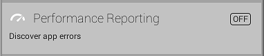
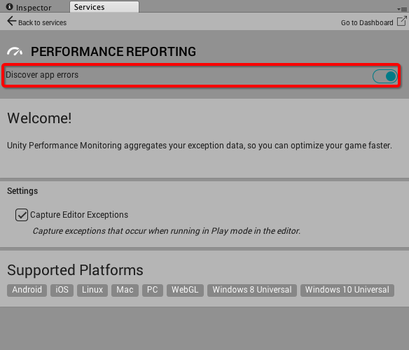

# 设置 Performance Reporting

[设置项目启用 Unity 服务](SettingUpProjectServices.html)之后，即可启用 Performance Reporting 服务。

## 如何启用 Performance Reporting

启用 Performance Reporting 的步骤如下：

1.在 Unity Editor 菜单栏中，选择 __Window__ > __Services__ 打开 Services 窗口。

2.在 Services 窗口中，选择 __Performance Reporting__。

3.单击黑色切换开关（如图 B 所示）以启用该服务。服务启用后，该开关变为蓝色。

* 2017-09-04  Page amended with limited [editorial review](DocumentationEditorialReview.html)

* 在 Unity 5.5 中添加了 __Capture Editor Exceptions__ 设置并将 __Optimize game performance__ 开关标签重命名为 __Discover app errors__
