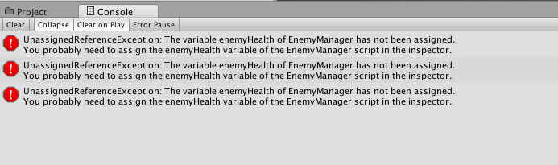
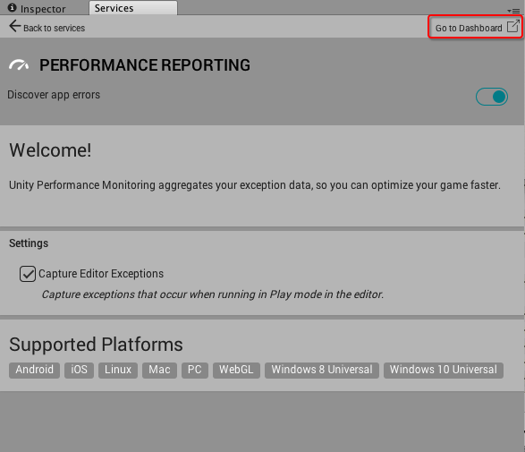
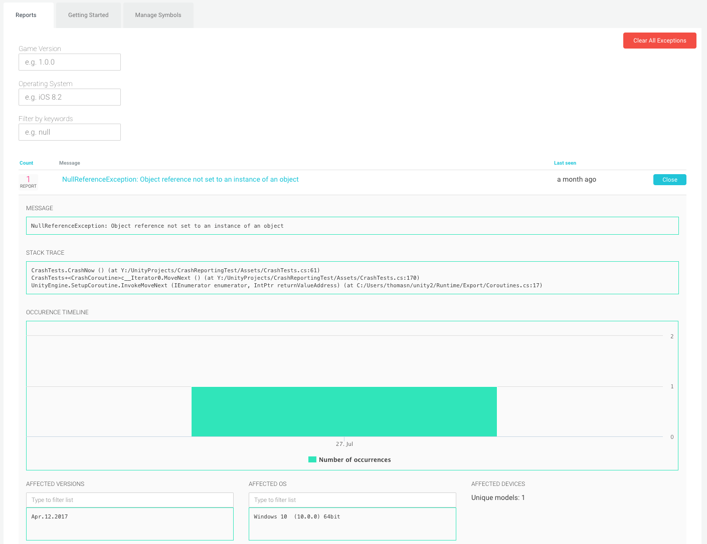
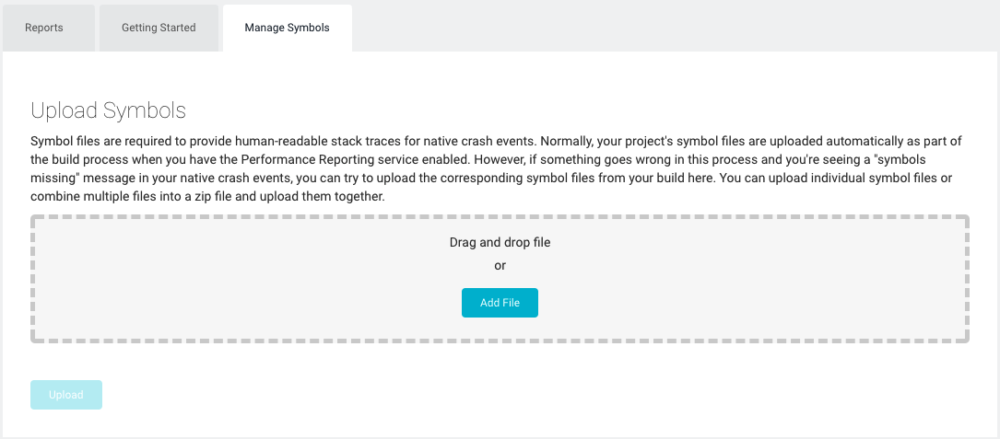

# 理解异常报告

在运行时发生的异常在控制台中标记为正常状态。启用 Performance Reporting 后，这些异常也会上报给 Performance Reporting Dashboard。

 

通过 Internet 浏览器可以在线访问该 Dashboard。请打开 Unity Editor 中的 __Performance Reporting__ 面板，然后选择 __Go to Dashboard__ 查看：

 

该 Dashboard 会显示最近异常列表。如需了解具体异常的更多信息，请单击该异常以展开视图：

  

展开后的视图会显示控制台消息、堆栈跟踪、发生时间线、受影响游戏版本、受影响操作系统以及受影响设备。

## Manage Symbols 选项卡

要为本地崩溃事件提供可读的堆栈跟踪，必须使用符号文件。正常情况下，启用 Performance Reporting 服务后，项目的符号文件将在编译过程中自动上传。但是，如果在此过程中出现问题，导致在本机崩溃事件中显示 "symbols missing" 消息，则可以尝试在此处从编译项目上传相应的符号文件。您可以上传单个符号文件，或将多个文件合并为一个 zip 文件后将它们一起上传。

符号上传处理程序可以处理以下格式：

* Mach-O：iOS/OSX，一个 .dSYM 文件夹
* ELF：Android/Linux，一个 .so 文件
* PDB：Windows，一个 .pdb 文件

符号文件的 UUID 或 GUID 标识符必须与 Dashboard 显示缺失的标识符匹配，才能使符号化成功。诸如 dwarfdump -u (OSX) 和 readelf -n (Linux) 之类的工具可以帮助您进行这些检查。有些工具报告的 UUID 包含破折号，但是破折号和大小写并不重要，只要标识符的字节与 Dashboard 上显示的字节匹配即可。

  

* 2017-09-04  Page amended with limited [editorial review](DocumentationEditorialReview.html)

* 在 Unity 5.6 中添加了 Manage Symbols 选项卡
