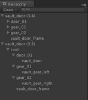

升级到 Unity 3.5
=======================

如果有一个 FBX 文件的根节点标记为骨架，则在 3.5 版中导入该文件时会产生额外的根节点（与 3.4 版相比）

 

Unity 3.5 这样做的原因是，在导入动画角色时，最常见的设置是让一个根节点下面包含所有骨骼，而根节点在层级视图中的旁边有一个骨架。
创建其他动画时，通常会从 fbx 文件中删除蒙皮网格。在这种情况下，新的导入方法将确保这个额外的根节点始终存在，因此动画和蒙皮网格会实际匹配。

如果在 3.4 版中实例与 FBX 文件的预制件之间已断开连接，则动画在 3.5 版中将不匹配，因此动画可能无法播放。

在这种情况下，建议通过将 FBX 文件拖到场景中并重新创建该文件来重新创建预制件或游戏对象层级视图。
