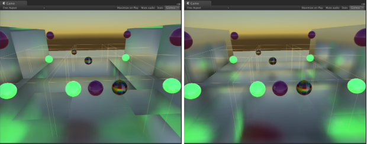

升级到 Unity 5.2
=================

全局光照
-------------------

烘焙 UV 的 UV 打包不填充 0-1 空间（更小或更大）的问题已经修复。现在，如果每个对象的展开未填充 0-1 空间以及对象的边界为非正方形的情况下，分配给该对象的分辨率更加可靠了。请查看烘焙光照贴图的实例上的分辨率。

以前，对于实时光照贴图，着色器变体剥离是固定的。现在可以分别为烘焙和实时 GI 选择每个光照贴图模式（非方向、方向和方向镜面模式）变体。如果以前在图形设置 (Graphics Settings) 中选择了特定的光照贴图模式变体，请检查设置，使该模式适用于实时光照贴图。

反弹比例已从任意值 0.7 更改为 1.0。反弹是反照率和反弹比例的乘积。美术师应该设定现实生活中的反照率值（最亮的非金属值是 0.9 的雪）。这是我们的 PBS 参考：[http://forum.unity3d.com/threads/official-5-0-pbr-calibration-charts.289416/](http://forum.unity3d.com/threads/official-5-0-pbr-calibration-charts.289416/)

由于应当设置物理上正确的反照率，因此我们将比例设置为接近 1 是合理的。我们已经在 Meta 通道中钳制了反照率值，使反弹比例应该恰好是 1.0f。

请注意，如果选择在自定义 Meta 通道中将反照率设置为 1.0 而不进行钳制，那么场景可能看起来像是在光照下发生爆炸。

着色器
-------

“固定函数”样式着色器（使用 SetTexture、Lighting On 等的着色器）现在会在着色器导入时在内部变为实际着色器。优点是这些着色器现在可在所有平台上运行（以前不能在游戏主机上运行），并具有更高的一致性。此外，在运行时消除了与许多代码和固定函数相关的低效率问题，使得渲染速度更快。缺点是在运行时使用 ``new Material(fixedFunctionShaderString)`` 创建固定函数着色器不再有效。该构造函数在 Unity 5.1 中已弃用，目前在 5.2 版中实际上已不可用于固定函数着色器。

反射探针
-----------------

我们已经更改使用延迟着色时渲染反射探针的方式，以便将来支持“屏幕空间反射”效果。简言之，在延迟着色中，反射探针现在是以逐像素而非逐对象的方式渲染的。

*比较当前行为（每个对象的反射探针；在某些情况下难以避免大对象之间的明显反射过渡）和每个像素的反射探针（过渡更加隐蔽；它们发生在探针边界而不是对象边界处）：*

 

以前（5.0 和 5.1）

* 在 G 缓冲区通道期间对反射探针进行采样，执行方式与前向渲染完全相同。它们与光照探针、光照贴图和发光材质部分一起写入“发射”缓冲区。

* 这意味着*每个对象*获得一个（启用探针混合时为两个）反射探针。

* 反射与同一缓冲区中的发射/光照贴图一起意味着“正确”执行 SSRR 是很难的。SSRR 本身提供反射（不能提供时则回退到反射探针），但是它不知道哪一部分“发射缓冲器”颜色来自反射探针。

现在 (5.2)

* 使用延迟着色时，在 G 缓冲区通道期间不对反射探针进行采样。

* 相反，在 G 缓冲区完成后，进行单独的“延迟反射”通道，将反射探针绘制为屏幕空间中的盒体；将反射信息输出到单独的渲染目标中。

* *[未来：SSRR 效果将使用此单独的反射缓冲区]*

* 最后结合反射缓冲区和发射缓冲区。

这是什么意思？*（以下所有内容仅影响延迟着色）*

* **反射探针不再是逐对象的**，而实际上是逐像素的。让大对象受到多个反射探针的影响会更容易。
    * 探针还得到了一个“混合距离”，此参数定义了探针周围有多少空间用于混合到其他探针中。
    * 较小的探针“覆盖”较大的探针。

* **反射探针渲染器标志（探针混合等）会被忽略**；一切都以相同的方式受到反射探针的影响（因为现在发生在屏幕空间中）。这一点与在延迟着色中忽略“接受阴影”标志的方式非常相似。

* 自定义编写的执行延迟着色的着色器大部分应该继续有效（在最坏的情况下，它们将采样黑色反射立方体贴图）。如果在着色器中做了一些突破常规的设置，则可能需要更新才能在 5.2 版中使用延迟着色。
    * 如果正在使用自定义延迟着色光照通道着色器（采用自定义 BRDF 等），可能还希望使用自定义延迟反射着色器，并将相同的 BRDF 应用于反射探针。

Shuriken
----------------------

现在会在世界空间中生成粒子，这可能需要更新所有自定义顶点着色器。进行这种改变是为了在 VR 的每只眼睛之间重复使用粒子缓冲区。

网格粒子现在支持 Texture Sheet Animation 模块。有必要确认现有的效果不会意外启用此模块，否则可能会看到行为发生变化。

Limit Velocity over Lifetime 模块中的 Dampen 参数以前在较高帧率下具有更强的效果。此问题现在已修复，如果游戏目标帧率为 30fps，旧效果将不受此更改的影响。但是，如果游戏的目标帧率 (FPS) 与此不同，可使用以下公式更新 Dampen 值，从而确保效果在 5.2 版中保持不变：

    newDampen = 1.0f - pow(1.0f - oldDampen, targetFPS / 30.0f);

图形（其他项）
----------------------

``Material.CopyPropertiesFromMaterial`` 现在也复制着色器关键字和渲染队列。如果以前依赖于不复制这些元素，现在必须更改代码。

现在需要重新生成 SpeedTree 材质，因为 SpeedTree 内置着色器发生了变化。可以通过在项目中选择 SpeedTree 预制件并点击“Apply & Generate Materials”按钮来完成此操作。*请注意，执行此操作后，对生成的材质资源的自定义设置（如果有）将被覆盖。*

UI
--

在 5.2 中，我们合并了向用户显示文本和普通 UI 元素的着色器。这样做的副作用是，如果指定 32 位格式的手动字体纹理，则会沿用颜色通道。这意味着黑色纹理通道将产生黑色文本，而以前文本会是白色的（我们只看 Alpha）。如果希望为字体使用自定义纹理，请执行以下操作之一：

1.将纹理的导入格式更改为 A8。这样便只会保留 Alpha 分量，因此 Unity 默认会将文本生成为白色。
1.在纹理中指定 Unity 在渲染文本时使用的一个或多个颜色

Multiplayer
-----------

项目标识的处理方式在 Unity 5.2 中已更改，现在项目会自动注册，无需在任何位置手动输入 ID。Services 窗口中有一个 Multiplayer 面板（在右上角使用云图标即可将其打开），在其中可以找到一个直接链接到网站上的项目的深层链接 (Go to dashboard)。配置后，此处将显示 Multiplayer 配置。

 

