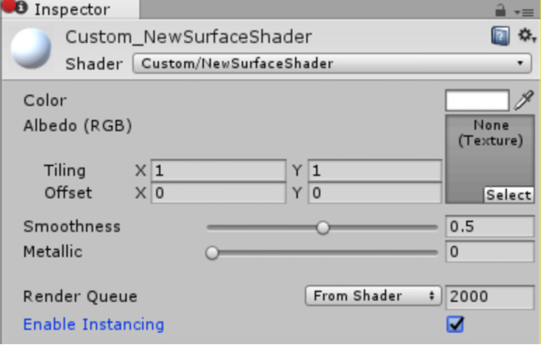
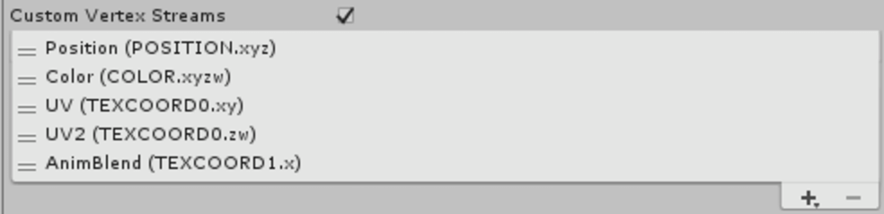

#升级到 Unity 5.6

本页面列出了从早期版本的 Unity 升级到 5.6 版时可能对现有项目造成影响的更改。

例如：

* 数据格式的变化可能导致需要重新烘焙。

* 任何现有函数、参数或组件值的含义或行为的变化。

* 任何函数或功能的弃用。（建议的替代方案。）

* * *

**脚本序列化错误不再有效**

Unity 5.4 中引入的脚本序列化错误（请参阅此[博客文章](https://blogs.unity3d.com/2016/06/06/serialization-monobehaviour-constructors-and-unity-5-4/)中的详细说明）从 5.6 版开始将始终抛出托管异常。

Unity 5.5 中的行为与 Unity 5.4 中的行为相同。

* * *

**PlayerSettings.apiCompatibilityLevel 已弃用**

现在这是一个根据平台而定的设置。
请改用 [PlayerSettings.SetApiCompatibilityLevel](../ScriptReference/PlayerSettings.SetApiCompatibilityLevel.html) 和 [PlayerSettings.GetApiCompatibilityLevel](../ScriptReference/PlayerSettings.SetApiCompatibilityLevel.html)。[PlayerSettings.apiCompatibilityLevel](../ScriptReference/PlayerSettings-apiCompatibilityLevel.html) 将继续有效，但只会影响当前的活动平台。

* * *

**光照更改**

已删除方向镜面光照贴图。

因此删除了 [LightmapsMode.SeparateDirectional](../ScriptReference/LightmapsMode.SeparateDirectional.html)。请改用 [LightmapsMode.CombinedDirectional](../ScriptReference/LightmapsMode.CombinedDirectional.html)。

以下是在 Unity 5.6 中获取镜面高光的首选方式：

* 对于直接镜面反射，具有实时直接光照的静态光源在所有模式下均可提供高质量的镜面高光，但 Subtractive 模式除外。请参阅 5.6 版用户手册的在线[光照](https://docs.unity3d.com/560/Documentation/Manual/LightingOverview.html)部分中的*混合光照*文档。

* 对于间接镜面反射，请使用[反射探针](class-ReflectionProbe.html)和/或[屏幕空间反射](https://github.com/Unity-Technologies/PostProcessing)[(SSR)](https://github.com/Unity-Technologies/PostProcessing)。

**混合模式光照已改进**

Unity 5.5 中的混合模式光照已被 Unity 5.6 中的静态光照模式所取代。这意味着需要进行大量更改，我们建议您仔细阅读*光照模式*文档，特别是 5.6 版用户手册在线[光照](https://docs.unity3d.com/560/Documentation/Manual/LightingOverview.html)部分中的*静态模式*草案文档，其中详细介绍了新提供的选项。

来自 Unity 5.6 之前版本的项目将升级为 **Subtractive** 模式（请参阅 5.6 版用户手册的在线[光照](https://docs.unity3d.com/560/Documentation/Manual/LightingOverview.html)部分中的 *Subtractive 光照模式*）。此模式与 Unity 5.5 的**混合**光照最接近。

但是，此模式是 Unity 5.6 的最低质量模式，因此请尝试其他模式以了解它们是否更适合您的项目。我们强烈推荐使用 **Shadowmask**（请参阅 5.6 版用户手册的在线[光照](https://docs.unity3d.com/560/Documentation/Manual/LightingOverview.html)部分中的 *Shadowmask* 页面和 *Distance Shadowmask* 页面，特别是您以前使用的是现已不存在的方向镜面光照贴图的情况下）。

新的 Unity 5.6 项目的默认设置为 **Distance shadowmask** 模式。（请参阅 5.6 版用户手册的在线[光照](https://docs.unity3d.com/560/Documentation/Manual/LightingOverview.html)部分中的 *Distance shadowmask* 页面。）

**光照探针**

在 Unity 5.6 中，无法再选择是否从 Lighting 窗口中向光照探针添加直接光照。此操作现在根据光源类型和静态模式自动发生。这确保了不会丢失直接光照，并且使用光照探针时在动态对象上不会产生双重光照，因而大大简化了此过程。

* * *

**新的 GPU 实例化工作流程**

现在必须为用于 GPU 实例化的所有材质选中新的 __Enable Instancing__ 复选框。这是确保 GPU 实例化正常工作的必要条件。

请注意，该复选框不会自动选中，因为 Unity 无法确定材质是否使用 5.6 版之前的着色器。

 

SpeedTree 资源也会出现升级错误，旨在帮助您重新生成 SpeedTree 材质，因此可以选中 __Enable Instancing__。

**注意：**新引入的程序实例化着色器（具有 `#pragma instancing_options procedural:func` 的着色器）不需要此更改，因为具有 `PROCEDURAL_INSTANCING_ON` 关键字的着色器不受影响。

* * *

**粒子系统更改**

如果使用了 `Particles/Alpha Anim Blend` 着色器，渲染器模块中的 `Custom Vertex Streams` 现在可能需要您手动升级粒子系统。在这种情况下，只需删除重复的 UV2 流就足够了。

之所以必须这样做，是因为在某些情况下需要重复的流来保持向后兼容性，因此没有完全可靠的自动升级解决方案。Normal 和 AnimFrame 流也不是必需的，但如果它们存在，并不会产生任何问题。修复的粒子系统设置应如下所示：

 

其次，升级后的 Emission 模块将导致连接了爆发发射 (Burst Emission) 的动画绑定 (Animation Bindings) 丢失。因此有必要重新绑定这些属性。

* * *

**动画器更改**

__Animate Physics__：如果对象的动画器已选择 _Animate Physics_，附加到这些对象的刚体现在会在动画化时将速度应用于它们。这样可以提供与其他物理对象之间的正确物理交互，并使动画器与动画组件所动画化的对象的行为保持一致。

这将影响动画化的刚体与其他刚体的交互方式（刚体被移动而不是每帧瞬移），因此请确认具有 __Animate Physics__ 的动画器的行为符合预期。

* * *

**动态批处理 2D 精灵**

应在包含 2D 精灵的升级项目中使用动态批处理。这样可以避免在搭载 Adreno 和 Mali 芯片组的设备上出现明显的精灵渲染性能问题。

要使用动态批处理，请打开 PlayerSettings（菜单：__Edit__ > __Project Settings__ > __Player__）。打开 __Other Settings__ 部分，在 __Rendering__ 下，勾选 __Dynamic Batching__ 复选框，并取消选中 __Graphics Jobs (Experimental)__ 复选框。请注意，这些是 5.6 版中创建的项目的默认设置。

图形作业 (Graphics Jobs) 应该不会影响动态批处理，但有时可能会在使用 Vulkan 和 DirectX12 的平台上导致意外行为。

***

**NUnit 库已更新**

[Unity Test Runner](testing-editortestsrunner.html) 使用 Unity 集成的 NUnit 库，这是一个用于 .NET 语言的开源单元测试库。在 Unity 5.6 中，此集成库已从 2.6 版更新到 3.5 版。此更新引入了一些可能会影响现有测试的重大更改。有关更多信息，请参阅 [NUnit 更新指南](https://github.com/nunit/docs/wiki/Upgrading)。

***

  
*  2017-05-19 Page amended with [editorial review](DocumentationEditorialReview.html)

