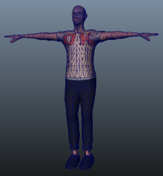

# 人形资源准备

为了充分利用 Unity 的人形动画系统和重定向，需要具有__骨架式__和__蒙皮式__人形类型网格。

1.角色__模型__通常由 3D 建模软件中的多边形组成，或者需要在导出之前从较复杂的网格类型转换为多边形或三角形网格。

2.为了控制角色的移动，必须创建一个__关节层级视图__或__骨架__，在其中定义网格内的骨骼以及它们相对于彼此的移动情况。创建此类关节层级视图的过程称为__骨架绑定 (rigging)__。

3.随后必须将网格或_皮肤_连接到关节层级视图。这定义了给定关节进行动画化时，角色网格的哪个部分移动。将骨架连接到网格的过程称为__蒙皮 (skinning)__。

## 如何获取人形模型

获取 Unity 动画系统中使用的人形模型主要有三种方法：

* 使用程序化角色系统或角色生成器（如 _Poser_、_Makehuman_ 或 [_Mixamo_](http://www.mixamo.com/)）。这些系统中，有些系统可对网格进行骨架绑定和蒙皮（如 Mixamo），而其他的则不能。此外，如果使用这些方法，可能需要减少原始网格中的多边形数量，以使其适合在 Unity 中使用。

* 从 [Unity Asset Store](http://unity3d.com/unity/asset-store/) 购买演示示例和角色内容。

* 还可通过以下三个步骤从头开始准备自建角色：[建模](#Modeling)、[骨架绑定](#Rigging)和[蒙皮](#Skinning)。

 
### 建模

此过程将在 3D 建模软件（如 3DSMax、Maya 或 Blender）中创建自定义的人形[网格](class-Mesh.html)。虽然这本身就是一个完整的主题，但为了确保模型在 Unity 项目中与动画顺利结合，可以遵循以下一些准则：

* 使用__结构良好__的拓扑。网格“良好”结构的具体含义相当微妙，但一般来说，应注意模型的顶点和三角形在动画化时的扭曲情况。不良的拓扑要求必须扭曲网格才能移动模型。请研究现有的 3D 角色网格，了解拓扑的排列方式和原因。

* 检查网格的__比例__。进行测试性导入，并将导入的模型的大小与“米立方体”(meter cube) 进行比较。标准 Unity 立方体图元的边长为一个单位，因此可在大多数用途中将其作为 1 米立方体。检查 3D 建模软件使用的单位并调整导出设置，使模型的大小与立方体成正比。创建没有任何比例概念的模型很容易，但这种做法的后果是，将模型导入 Unity 时可能产生一组大小不成比例的对象。

* 对网格进行排列，使角色的双脚站在模型的局部原点或“锚点”上。由于角色通常在地面上直立行走，如果其锚点（即其变换位置）直接位于该地面上，则会大幅降低处理难度。

* 如有可能，以 __T 形姿势__建模。这样可提供在必要位置（例如腋下）细化多边形细节的空间。此外也更容易将骨架放置在网格内。

* 在构建时，__清理您的模型__。在可能的情况下，请盖住孔洞、焊接顶点并移除隐藏面。这有助于蒙皮，尤其是自动蒙皮过程。

 
### 骨架绑定

此过程创建关节骨架来控制模型运动。

3D 建模软件提供了多种方法为人形骨架创建关节。从现成的两足动物骨架（可以缩放这些骨架来适应个人需求的网格），一直到用于单独骨骼创建和父子化以自行创建骨骼结构的工具。为了在 Unity 中与动画结合使用，请确保它们是骨骼层级视图的根元素。骨架中至少需要 15 个骨骼。

骨架必须具备所需的最少骨骼才能让 Unity [产生有效的匹配](class-Avatar.html)。为了提高与 Avatar 相匹配的机会，请确保骨骼的命名方式反映了其所代表的身体部位。例如，“LeftArm”和“RightForearm”明确显示了这些骨骼的控制对象。

关节/骨骼层级视图应遵循所创建的角色的自然结构。鉴于手臂和大腿成对出现，应使用一致的约定来命名它们（例如，左臂为“arm_L”，右臂为“arm_R”）。层级视图的可能结构包括：

    * HIPS - spine - chest - shoulders - arm - forearm - hand
    * HIPS - spine - chest - neck - head
    * HIPS - UpLeg - Leg - foot - toe - toe_end

 
### 蒙皮

此过程将网格连接到骨架。

蒙皮过程涉及将网格中的顶点绑定到骨骼：既可直接绑定（刚性绑定），也可通过混合影响将顶点绑定到多个骨骼（软性绑定）。不同的 3D 建模软件使用不同的方法。例如，可以分配各个顶点，并将每个骨骼的影响权重绘制到网格上。初始设置通常是自动化的，例如通过查找最近的影响或使用“热图”。蒙皮通常需要进行大量的工作和动画测试，以便确保皮肤变形取得令人满意的结果。此过程的一些一般准则包括：

* 最初使用自动化过程来设置某种蒙皮（请参阅 3D 建模软件提供的蒙皮教程）。

* 为骨架创建简单的动画，或导入一些动画数据用于蒙皮测试。这样应该就能快速评估蒙皮是否在运动中看起来良好。

* 逐步编辑和优化蒙皮解决方案。

* 将使用软性绑定时的影响数量限制为最多四个（因为这是 Unity 支持的最大数量）。如果网格使用四种以上的影响，则在 Unity 中播放动画时会丢失一些信息。

## 导出并验证

Unity 可导入许多不同的通用和原生 3D 文件格式。FBX 是导出和验证模型的推荐格式，因为可以使用它来执行以下操作：

* 导出网格以及骨架层级视图、法线、纹理和动画。
* 将网格重新导入 3D 建模软件，从而验证动画模型是否符合预期。
* 导出不含网格的动画。

---

*  2018-04-25  Page amended with limited [editorial review](DocumentationEditorialReview.html)

