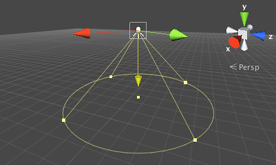

#使用光源

光源在 Unity 中非常容易使用：只需创建所需类型的光源（例如，从菜单 __GameObject &gt; Light &gt; Point Light__ 进行创建），并将其放置在场景中的所需之处。如果启用 Scene 视图光照（工具栏上的“太阳”按钮），则可在移动光源对象并设置其参数时预览光照效果。

 

方向光通常可放置在场景中的任何位置（除非使用剪影 (Cookie) 的情况下），由前向/Z 轴指示方向。聚光灯也有方向，但由于其范围有限，它的位置很_重要_。可从检视面板或直接在 Scene 视图中使用光源的_辅助图标（Gizmos）_来调整聚光灯、点光源和面光源的形状参数。

##放置光源的准则

方向光通常代表太阳并且对场景的外观具有显著影响。光线方向应略微向下，但您通常需要确保光线与场景中的主要对象形成一个小角度。例如，对于一个大致形状为立方体的对象，如果光线未正面照射立方体的任何一面，该立方体的着色将更有趣并会在 3D 模式下显得“突出”得多。

聚光灯和点光源通常代表人造光源，因此它们的位置通常由场景对象决定。这些光源的一个常见疑惑是，当您第一次将它们添加到场景时，它们似乎根本没有任何效果。当您调整光源的作用范围以便适应场景要求时，便会发生这种情况。光源的作用范围是光的亮度变暗为零的界限。比如说，如果设置一个聚光灯，使锥体的底部恰好落在地板上，那么除非另一个对象从该光源下面通过，否则几乎没有任何效果。如果您希望关卡几何体接受光照，则应扩展点光源和聚光灯，使它们穿过墙壁和地板。

##颜色和强度

光源的颜色和强度（亮度）是可从检视面板中设置的属性。默认的强度和白色适用于为对象着色的“普通”光照，但您可能希望改变属性以便产生特殊效果。例如，一个发光的绿色力场可能足够亮到在强烈的绿光下沐浴周围的对象；汽车前照灯（特别是在旧车上）通常具有淡黄色而不是亮白色的灯光。这些效果最常用于点光源和聚光灯，但在某些情况下，比如说，如果游戏背景是有红色太阳的遥远星球，则可能也需要改变方向光的颜色。
