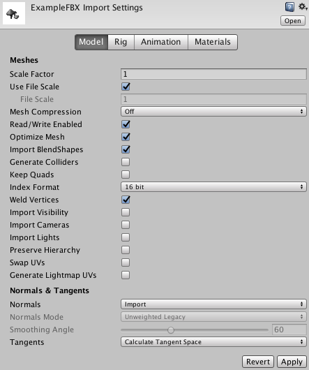
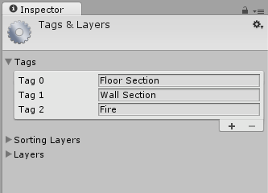

#Inspector 窗口

Unity Editor 中的项目由多个[游戏对象](GameObjects.html)组成，而这些游戏对象包含脚本、声音、网格和其他图形元素（如光源）。Inspector 窗口（有时称为“Inspector”）显示有关当前所选游戏对象的详细信息，包括所有附加的[组件](Components.html)及其属性，并允许修改场景中的游戏对象的功能。

##检查游戏对象

使用 Inspector 可以查看和编辑 Unity Editor 中几乎所有内容（包括物理游戏元素，如游戏对象、资源和材质）的属性和设置，以及 Editor 内的设置和偏好设置。

在 [Hierarchy](Hierarchy.html) 或 [Scene](UsingTheSceneView.html) 视图中选择游戏对象时，Inspector 将显示该游戏对象的所有组件和材质的属性。使用 Inspector 可以编辑这些组件和材质的设置。

上图显示的 Inspector 中选择了 Main Camera 游戏对象。除了游戏对象的 Position、Rotation 和 Scale 值之外，还可以编辑 Main Camera 的所有属性。

##检查脚本变量

当游戏对象附加了自定义脚本组件时，Inspector 会显示该脚本的公共变量。可以像编辑 Editor 的内置组件的设置一样将这些变量作为设置进行编辑。这意味着可以轻松地在脚本中设置参数和默认值，而无需修改任何代码。

##检查资源

在 [Project 窗口](ProjectView.html)中选择[资源](AssetWorkflow.html)后，Inspector 将显示关于如何导入资源和在运行时（游戏在 Editor 中或已发布的版本中运行时）使用该资源的设置。

每种类型的资源都有一组不同的设置。以下各图显示了 Inspector 的一些示例，其中展示了其他资源类型的导入设置：

[模型导入设置](class-FBXImporter.html)窗口的 [Model 选项卡](FBXImporter-Model.html)：

[音频剪辑导入设置](class-AudioClip.html)窗口：

[纹理导入设置](class-TextureImporter.html)窗口：

##预制件

如果选择了预制件，则 Inspector 窗口中会提供一些额外的选项。

有关更多信息，请参阅关于[预制件](Prefabs.html)的文档。

##项目设置

选择任何项目设置类别（菜单：__Editor__ > __Project Settings__）时，这些设置将显示在 Inspector 窗口中。有关更多信息，请参阅关于[项目设置](comp-ManagerGroup.html)的文档。

##图标和标签

可为游戏对象和脚本分配自定义图标。这些图标显示在 Scene 视图中，同时还有光源和摄像机等游戏对象的内置图标。

有关图标和标签的更多信息，请参阅关于[分配图标](AssigningIcons.html)的 Unity 文档。

##对组件重新排序

要在 Inspector 窗口中对组件重新排序，请将组件的标题从一个位置拖放到另一个位置。拖动组件标题时，会出现蓝色插入标记。此标记显示了拖动标题时可以将组件放置到的位置：

只能对一个游戏对象上的组件重新排序。不能在不同的游戏对象之间移动组件。

还可以将脚本资源直接拖放到期望的位置。

选择多个游戏对象时，Inspector 会显示所选的多个游戏对象共有的所有组件。要一次性重新排序所有这些共有组件，请选择多个游戏对象，然后在 Inspector 中将组件拖放到新位置。

在 Inspector 窗口中为组件指定的顺序便是在查询用户脚本中的组件时需要使用的顺序。如果以编程方式查询组件，您将得到在 Inspector 中显示的顺序。

---

* 2018-04-23 Page amended with limited [editorial review](DocumentationEditorialReview.html)

* 在 Unity 5.6 中添加了组件拖放功能

