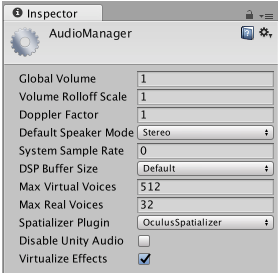

#VR 空间音响

Unity 本身支持用于虚拟现实 (VR) 项目的[空间音响](AudioSpatializerSDK.html)。空间音响改变了音频从音频源传输到周围空间的方式：该插件获取音频源，并基于[音频监听器 (AudioListener)](class-AudioListener.html) 和[音频源 (AudioSource)](class-AudioSource.html) 之间的距离和角度来调节左耳和右耳影响力的增益。

通过 Audio Settings 窗口（菜单：__Edit &gt; Project Settings &gt; Audio__）使用 __Spatializer Plugin__ 下拉选单可启用这些插件。原生插件可以在启用或不启用 VR 模式的情况下使用。

 

空间音响插件仅适用于支持 VR 设备的平台。如果构建目标不支持某个设备，Unity 会显示一条警告，指出该插件不会包含在构建的应用程序中。

每个插件都可 Editor 中用于测试目的。

本机包含的空间音响插件：

* Oculus Spatializer（支持 Android、OSX 和 PC）
* Microsoft HRTF Spatializer（支持 UWP 和运行 Windows 10 的 PC）
