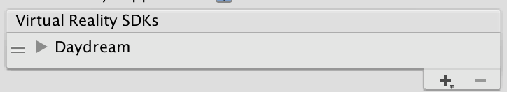
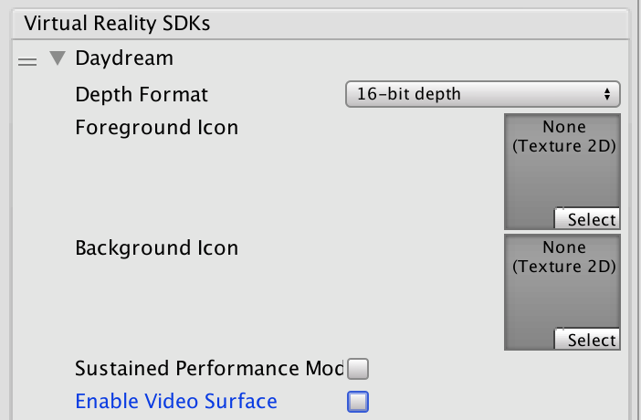
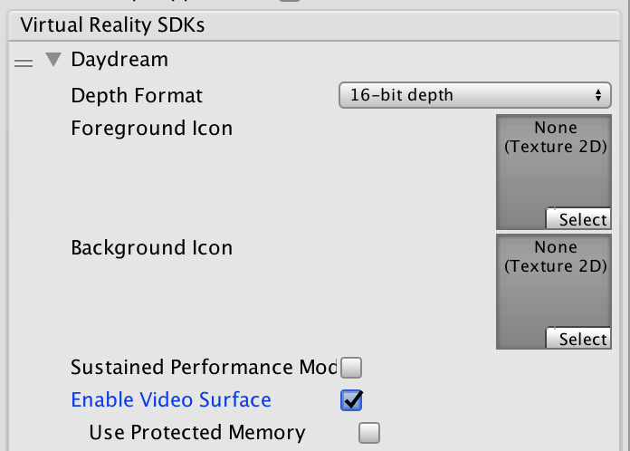

#Unity Google VR 视频异步重投影 (Video Async Reprojection)

<!-- XR overhaul - https://trello.com/c/Qw7imxOL --> 

##什么是视频异步重投影？

异步重投影视频是一个层（称为__外部表面__），应用程序可以使用该层将视频帧直接馈送到异步重投影系统。使用该 API 的主要优点包括：

1.如果没有该 API，则会对视频进行一次采样以渲染到应用程序的颜色缓冲区中，然后再次对颜色缓冲区进行采样以执行失真校正。这样就引入了双重采样瑕疵。外部表面将视频直接传递给 EDS 合成器，因此只对其采样一次，从而可提高视频的画质。

2.使用外部表面 API 时，视频帧率与应用程序帧率分离。应用程序可能需要 1 秒钟来渲染新帧，唯一的结果是用户在移动头部时会看到黑条，而视频将继续正常播放。这样应该可以显著减少丢弃的视频帧，并保持 AV 同步

3.应用程序可以标记自己希望播放 DRM 视频，然后 API 将创建一个受保护的路径来显示受保护的视频并维持异步重投影帧率。

##已知问题：

1.使用视频异步重投影时，摄像机必须从原点 (0,0,0) 开始。如果摄像机的位置未设置为 0,0,0，可能会出现错误。

2.异步重投影没有可公开访问的 C# 接口。公共 API 仅限于 Java。

##启用异步视频重投影

异步视频重投影是 Daydream VR 设备设置的一部分。



单击 Daydream 旁边的灰色箭头，然后选中 __Enable Video Surface__ 复选框，即可启用异步视频重投影功能



仅当需要对所有内容进行内存保护时，才选中 __Use Protected Memory__ 选项，因为启用此选项意味着会在应用程序的整个生命周期内启用。



##API 文档

要利用 Google VR API，必须扩展 UnityPlayerActivity。有关更多信息，请参阅有关[扩展 UnityPlayerActivity](AndroidUnityPlayerActivity.html) 的文档。

Java 插件无法直接访问场景中的对象，因此需要为 C# 代码提供一个简单的 API，以便将一个变换传递给 Java 端并告诉 Java 代码何时开始渲染。

__注意：__以下代码不完整。代码中不包含视频播放器的实现，因为这是特定于客户端的实现细节。代码中也没有任何播放控件，而这些控件必须实现，因为场景中的对象以及这些对象上的操作需要调用 Java。

有关在 Unity 中使用 Java 和扩展 UnityPlayerActivity 的信息，请参阅关于[在 Unity 中进行 Android 开发](android.html)的文档。

有关 Google 视频异步重投影系统的信息，请参阅有关[视频视口 (Video Viewports)](https://developers.google.com/vr/reference/android-ndk/gvr-ndk-rendering#using_video_viewports) 的 Android Developer Network 文档。

###Java 示例代码：

```
package com.unity3d.samplevideoplayer;

import com.unity3d.player.GoogleVrVideo;

import com.unity3d.player.GoogleVrApi;

import android.app.Activity;

import android.os.Bundle;

import android.util.Log;

import android.view.Surface;

public class GoogleAVRPlayer implements GoogleVrVideo.GoogleVrVideoCallbacks {

	private static final String TAG = GoogleAVRPlayer.class.getSimpleName();

	private MyOwnVideoPlayer videoPlayer;

	private boolean canPlayVideo = false;

	private boolean isSceneLoaded = false;

	// 提供给 C# 代码的 API，用于处理视频系统的

	// 初始化。

	public void initVideoPlayer(UnityPlayerActivity activity) {

	 //初始化视频播放器和所需的任何其他支持…

	 // 将此实例注册为 Google VR 视频监听器，从而获取

	 // 生命周期和控制回调。

    	 GoogleVrVideo gvrv = GoogleVrApi.getGoogleVrVideo();

    	 if (gvrv != null) gvrv.registerGoogleVrVideoListener(this); 

	}

 

	//提供给 C# 代码的 API，用于启动播放视频的

	// 视频系统。

	public void play()

	{

    	   if (canPlayVideo && videoPlayer != null && videoPlayer.isPaused())

        	videoPlayer.play();

	}

	//提供给 C# 代码的 API，用于停止播放视频的

	// 视频系统。

	public void pause()

	{

    	    if (canPlayVideo && videoPlayer != null && !videoPlayer.isPaused())

        	videoPlayer.pause();    	

	}

	// Google VR 视频监听器

	@Override

	public void onSurfaceAvailable(Surface surface) {

	 // Google VR 有一个可供渲染的表面。

	 //根据需要将此表面与视频播放器结合使用。

    	 if (videoPlayer != null){

        	videoPlayer.setSurface(surface);

        	canPlayVideo = true;

        	if (isSceneLoaded)

        	{

            	videoPlayer.play();

        	}

    	  }

	}

	@Override

	public void onSurfaceUnavailable() {

	 //Google VR 视频表面即将消失。您需要将其

	 // 从其持有者中移除并停止视频播放器。

        if (videoPlayer != null){

        	videoPlayer.pause();

        	canPlayVideo = false;

    	  }

	 }

	@Override

	public void onFrameAvailable() {

	 //处理 Google VR 帧可用的回调

	}
}

```
###Unity C# 示例代码：

```
using System;

using System.Collections;

using System.Collections.Generic;

using System.Text;

using UnityEngine;

public class GoogleVRVideo : MonoBehaviour {

 private AndroidJavaObject googleAvrPlayer = null;

 private AndroidJavaObject googleVrVideo = null;

 void Awake()

 {

    if (googleAvrPlayer == null)

    {

      googleAvrPlayer = new AndroidJavaObject("com.unity3d.samplevideoplayer.GoogleAVRPlayer");

    }

    AndroidJavaObject googleVrApi = new AndroidJavaClass("com.unity3d.player.GoogleVrApi");

    if (googleVrApi != null) googleVrVideo = googleVrApi.CallStatic<AndroidJavaObject>("getGoogleVrVideo");

 }

 void Start()

 {

  if (googleVrVideo != null)

  {

   // 我们需要告诉 Google VR 该视频表面在世界空间中

   // 的位置。由于没有办法从 Java 获取该信息，

   // 我们可以在此处执行此操作，然后将算出的矩阵向下传递给

   // 我们在 UnityPlayerActivity 子类上公开的 API。

   Matrix4x4 wm = transform.localToWorldMatrix;
   
   wm = Camera.main.transform.parent.worldToLocalMatrix * wm;
   
   wm = wm * Matrix4x4.Scale(new Vector3(0.5f, 0.5f, 1));


   //将 4x4 行有序矩阵转换为 16 个元素列的有序

   // 平面数组。换位是为了确保矩阵符合

   // Google 使用的顺序，我们将其展平可以

   // 更轻松地通过 JNI 边界。复杂之处在于必须

   //在 Java 端将其转换回 4x4 矩阵。

   float[] matrix = new float[16];

   for (int i = 0; i < 4; i++)

   {

    for (int j = 0; j < 4; j++)

    {

     matrix[i * 4 + j] = wm[j,i];

    }

   }

   googleVrVideo.Call("setVideoLocationTransform", matrix);  

  }

  

  if (googleAvrPlayer != null)

  {

    AndroidJavaClass jc = new AndroidJavaClass("com.unity3d.player.UnityPlayer");

    AndroidJavaObject jo = jc.GetStatic<AndroidJavaObject>("currentActivity");

    googleAvrPlayer.Call("initVideoPlayer", jo);

    googleAvrPlayer.Call("play");

  }

 }

}

```
---

* <span class="page-edit">2017-08-03  Page published with limited [editorial review](DocumentationEditorialReview.html)
</span>
* <span class="page-history">于 [2017.2](https://docs.unity3d.com/2017.2/Documentation/Manual/30_search.html?q=newin20172) 添加 <span class="search-words">NewIn20172</span></span>
