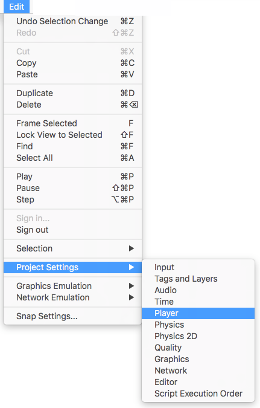
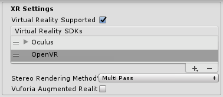

VR 概述
===========
<!-- https://trello.com/c/Qw7imxOL --> 

Unity VR 允许直接从 Unity 中以虚拟现实设备为目标，而无需项目中的任何外部插件。它提供了基本 API 和功能集，可兼容多种设备。根据设计，还可为未来的设备和软件提供前向兼容性。

*注意：**XR 是一个总括性术语，包括虚拟现实 (VR)、增强现实 (AR) 和混合现实 (MR)。我们正在更新我们的 XR 文档，但是现在这个文档主要只介绍 VR。***

**Unity 的 XR API 已经更新来反映更广泛的术语“XR”，但是文档大部分内容目前仍使用术语“VR”。XR API 表面在设计上是最小的，但会随着 XR 的不断成长而扩展。**

通过使用 Unity 中的原生 VR 支持，您将获得：

* 每个 VR 设备的稳定版本
* 用于与不同 VR 设备进行交互的单个 API 接口
* 一个纯净的项目文件夹，无需每个设备的外部插件
* 在应用程序中包含和切换多个设备的能力
* 更高的性能（本机设备可以实现更低级别的 Unity 引擎优化）

##启用 Unity VR 支持

要为您的游戏版本和 Editor 启用原生 VR 支持，请打开 [Player Settings](class-PlayerSettings.html)（菜单：__Edit__ > __Project Settings__ > __Player__）。选择 __XR Settings__ 并选中 __Virtual Reality Supported__ 复选框。对每个构建目标都进行此设置。在独立构建中启用虚拟现实支持不会也为 Android 启用该支持（反之亦然）。

使用该复选框下方显示的 __Virtual Reality SDKs__ 列表为每个构建目标添加和删除 VR 设备。列表的顺序是 Unity 尝试在运行时启用 VR 设备的顺序。第一个正确初始化的设备便是启用的设备。此列表顺序在构建的播放器中是相同的。

##构建的应用程序：选择启动设备

构建的应用程序按照与 __XR Settings__ 中的 __Virtual Reality SDKs__ 列表相同的顺序来初始化和启用设备（请参阅上文的[启用 VR 支持](#EnablingVRSupport)）。在构建时未出现在列表中的设备在最终构建中不可用。此原则的例外是 __None__；设备 __None__ 相当于非 VR 应用程序（即普通的 Unity 应用程序），即使不包含在列表中也可在运行时切换到该类型。

在列表中包含 __None__ 作为设备允许在尝试 VR 设备初始化之前默认使用非 VR 应用程序。如果将 __None__ 放在列表顶部，则应用程序将在禁用 VR 的情况下启动。然后，可以通过脚本使用 [XR.XRSettings.LoadDeviceByName](../ScriptReference/XR.XRSettings.LoadDeviceByName.html) 来启用和禁用列表中存在的 VR 设备。

如果尝试切换到的设备在初始化时失败，Unity 将禁用 VR 并让该设备仍设置为激活的 VR 设备。切换设备 ([XRSettings.LoadDeviceByName](../ScriptReference/XR.XRSettings.LoadDeviceByName.html)) 或启用 XR ([XR.XRSettings-enabled](../ScriptReference/XR.XRSettings-enabled.html)) 时，构建的应用程序会尝试再次初始化。

用于启动特定设备的命令行参数为：

``-vrmode DEVICETYPE``

其中的 __DEVICETYPE__ 是支持的 [XR 支持设备列表](../ScriptReference/XR.XRSettings-supportedDevices.html)中的名称之一。

示例：``MyGame.exe -vrmode oculus``

##启用 VR 后时发生什么

在 Unity 中启用 VR 时，会自动执行以下操作：

###自动渲染到头戴式显示器

场景中的所有摄像机都可以直接渲染到头戴式显示器 (HMD)。视图和投影矩阵会自动调整来适应头部跟踪、位置跟踪和视野。

可使用摄像机 (Camera) 组件的 __stereoTargetEye__ 属性禁止渲染到 HMD。或者，也可使用 __Target Texture__ 属性将摄像机设置为渲染到渲染纹理。

* 使用 stereoTargetEye 属性可将摄像机设置为仅将特定眼睛渲染到 HMD。这种设置对于呈现狙击镜或立体视频等特殊效果非常有用。要实现此目的，请在场景中添加两个摄像机：一个瞄准左眼，另一个瞄准右眼。通过设置层遮罩来配置发送到每只眼睛的内容。

###自动头部跟踪输入

如果采用的是头戴式设备，则会自动将头部跟踪和相应的视野 (FOV) 应用于摄像机。可以手动将 FOV 设置为特定值，但不能直接设置摄像机的变换值。请参阅下面的[了解摄像机](#UnderstandingTheCamera)部分以获取更多信息。

头部跟踪和位置跟踪将自动应用，确保在渲染帧之前，位置和方向最接近用户的位置和方向。这样可以提供良好的 VR 体验，防止用户出现恶心感。

 

###了解摄像机

摄像机变换由头部跟踪姿势进行覆盖。要移动或旋转摄像机，请将其附加为另一个游戏对象的子项。这样一来，所有对摄像机父项进行的变换更改都会影响摄像机本身。使用脚本移动或旋转摄像机也是如此。

可以将摄像机的位置和方向想象为用户在中立位置观察的位置。

坐姿和房间规模 VR 体验之间存在差异：

* 如果设备支持房间规模体验，则摄像机的起始位置是用户游戏空间的中心位置。
* 采用坐姿体验时，可使用 [XR.InputTracking.Recenter()](../ScriptReference/XR.InputTracking.Recenter.html) 将摄像机重置为中立位置。

渲染到设备的每个摄像机会自动使用用户在每个 VR SDK 的软件设置中输入的 FOV 替换摄像机的 FOV。用户无法在运行时更改视野，因为目前已知此行为会导致晕动症。

##Editor 模式

如果 VR 设备支持 Unity Editor 模式，请在 Editor 中按 Play 直接在设备上进行测试。

如果已将 __stereoTargetEye__ 设置为左眼或双眼，则左眼将渲染到 Game 视图窗口。如果已将 __stereoTargetEye__ 设置为右眼，则将渲染右眼。

没有左眼和右眼的自动并排视图。要在 Game 视图中查看并排视图，请创建两个摄像机，将一个摄像机设置为左眼，另一个设置为右眼，并设置视口来并排显示它们。

请注意，在 Editor 中运行会产生开销，因为 Unity 集成开发环境 (IDE) 需要渲染每个窗口，因此可能会遇到延迟或抖动。要减少 Editor 渲染开销，请打开 Game 视图并启用 __Maximize on Play__。

Unity Profiler 是一个有用的工具，可用于了解在 Editor 外运行时的性能。但是，性能分析器 (Profiler) 本身也有开销。检查游戏性能的最佳方法是在目标平台上进行构建并直接运行。运行非开发版本时可以看到最佳性能，但开发版本允许连接 Unity Profiler 来进行更好的性能分析。

##在 Unity 中进行 VR 开发的硬件和软件建议

###硬件

实现与目标 HMD 类似的帧率对于获得良好的 VR 体验至关重要。此帧率必须与 HMD 中使用的显示器的刷新率相匹配。如果帧率低于 HMD 的刷新率，则会特别明显，并通常导致玩家恶心。

下表列出了常见 VR 头盔的设备刷新率：

|**_VR 设备_** |**_刷新率_** |
|:---|:---|
|Gear VR| 60hz|
|Oculus Rift|90hz|
|Vive|90hz|

###软件

* **Windows**：Windows 7、8、8.1 和 Windows 10 全都兼容。

* **Android**：Android OS Lollipop 5.1 或更高版本。

* **OS X**：OSX 10.9+ 以及 Oculus 0.5.0.1 运行时。但是，Oculus [暂停了 OS X 的相关开发](https://www.oculus.com/en-us/blog/powering-the-rift/)，因此在 Unity 中使用 Windows 提供原生 VR 功能。

* **显卡驱动程序**：确保驱动程序是最新的。每种设备都在不断推出最新的驱动程序，因此可能不支持旧驱动程序。

##设备运行时要求
每个 VR 设备都要求在计算机上安装适当的运行时。例如，要在 Unity 中开发和运行 Oculus，必须在计算机上安装 Oculus 运行时（也称为 Oculus Home）。对于 Vive，则需要安装 Steam 和 SteamVR。

根据所使用的 Unity 版本，Unity 支持的每个特定设备的运行时版本可能会有所不同。您可以在 Unity 每个主要和次要版本的发行说明中找到运行时版本。

在推出某些版本更新时，不再支持以前的运行时版本。这意味着原生 Unity VR 支持不再适用于早期的运行时版本，但继续适用于新的运行时版本。

Unity 原生 VR 支持不会从项目文件夹中读取插件，因此如果启用了 VR 支持，则将早期版本的插件与原生支持包含在一起将导致插件失效。如果希望将早期版本的插件与不再支持该版本的 Unity 版本结合使用，请禁用 __Native VR Support__（选择 __XR Settings__ 并取消选中 __Virtual Reality Supported__）。然后，即可像任何其他第三方插件一样访问该插件。有关更多详细信息，请参阅上文关于[启用 Unity VR 支持](#EnablingVRSupport)的部分。

