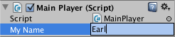
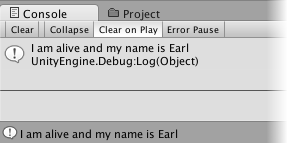

变量和 Inspector
=============================

在创建脚本时，实际上是在自定义新的组件类型，可以像任何其他组件一样将这种组件附加到游戏对象。

正如其他组件通常具有可在 Inspector 中编辑的属性一样，您也可以让自己脚本中的值可在 Inspector 中编辑。


````
using UnityEngine;
using System.Collections;

public class MainPlayer : MonoBehaviour {
	public string myName;
	
	// 使用此函数进行初始化
	void Start () {
		Debug.Log("I am alive and my name is " + myName);
	}
	
	// 每帧调用一次 Update
	void Update () {
	
	}
}

````

此代码在 Inspector 中创建一个标记为“My Name”的可编辑字段。


 

Unity 通过在变量名称中出现大写字母的位置引入空格来创建 Inspector 标签。但是，这纯粹是出于显示目的，在代码中应始终使用变量名称。如果编辑该名称，然后按 Play，您将看到消息中包含您输入的文本。


 

在 C# 中，必须将变量声明为 public 才能在 Inspector 中查看该变量。在 UnityScript 中，默认情况下变量均为 public，除非显式指定为 private：


````
# pragma strict

private var invisibleVar: int;

function Start () {

}

````

Unity 实际上允许您在游戏运行时更改脚本变量的值。此功能很有用，无需停止和重新启动即可直接查看更改的效果。当游戏运行过程结束时，变量的值将重置为按下 Play 之前所处的任何值。这样可确保自由调整对象的设置，而不必担心会造成任何永久性损坏。
