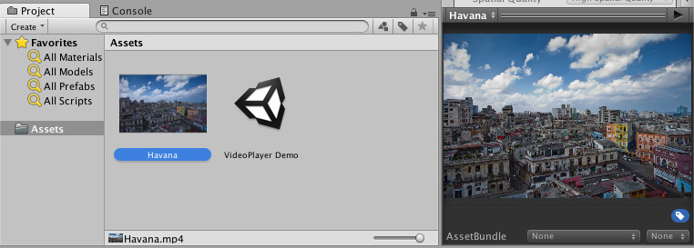

# 视频源

[视频播放器 (Video Player) 组件](class-VideoPlayer.html)可播放从各种来源导入的内容。

## 视频剪辑

要创建和使用视频剪辑资源，必须先导入视频文件。

将视频文件拖放到 Project 窗口中即可创建一个视频剪辑。

创建视频剪辑的另一种方法是导航到 __Assets__ > __Import New Asset...__ 来导入视频文件。

导入后，可在视频播放器组件中选择新创建的视频剪辑，为此可使用 __Select VideoClip__ 窗口（通过单击 Video Clip 字段右侧的圆圈选择按钮即可访问此窗口），也可将视频剪辑资源拖放到相应的视频播放器组件字段中。

## URL

使用 __Source__ 下拉菜单可将视频源设置为 __URL__（此属性在默认情况下设置为 __Video Clip__）。将 __Source__ 设置为 __URL__ 可直接使用文件系统中的文件（有或没有 *file://* 前缀）。

__URL__ 源选项会绕过资源管理，这意味着您必须手动确保 Unity 可以找到源视频。例如，一个 Web URL 需要由 Web 服务器托管源视频，而普通文件必须位于 Unity 可以找到该文件的位置（用脚本表示）。但是，如果内容不在 Unity 的直接控制之下，或者您希望避免在本地存储大型视频文件，则此功能非常有用。

如果将视频播放器组件源设置为 __URL__，也可通过 *http://* 和 *https://* 从 Web 源读取视频。在这些情况下，Unity 会执行必要的预缓冲和错误管理。

## Asset Bundles

也可从 [Asset Bundle](AssetBundlesIntro.html) 读取视频剪辑。

将这些视频剪辑导入后，即可通过将它们分配给视频播放器组件的 __Video Clip__ 字段来使用它们。

## 流媒体资源 (Streaming Assets)

置于 Unity 的 [StreamingAssets](StreamingAssets.html) 文件夹中的文件可通过视频播放器组件的 __URL__ 选项（见上文）进行使用，也可借助特定于平台的路径 (*Application.streamingAssetsPath*) 进行使用。

---

* 2017-06-15 Page published with limited [editorial review](DocumentationEditorialReview.html)

* Unity 5.6 中的新功能
