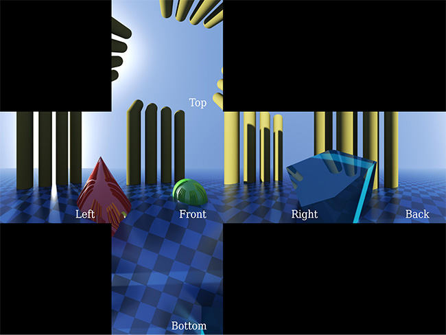
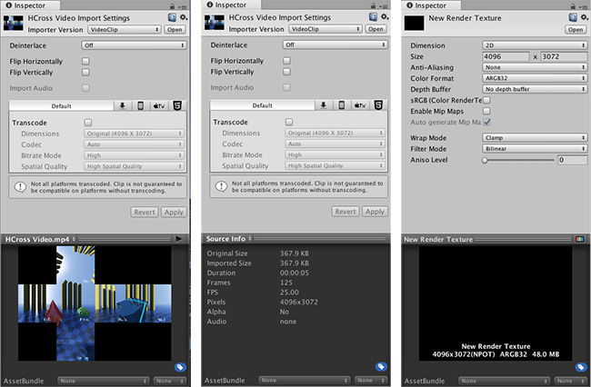
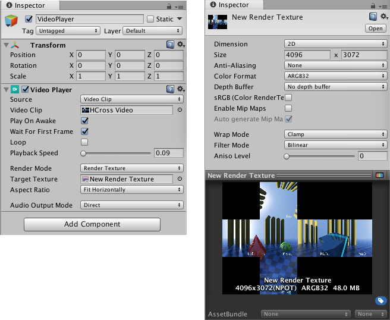
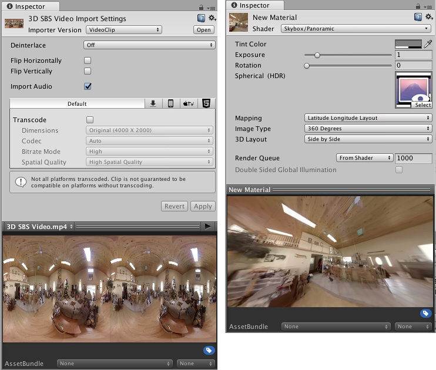

# 全景视频

Unity 的全景视频功能可以让您：

* 轻松添加 360 度真实视频镜头。
* 通过添加预渲染的背景视频而不是真实的几何体，降低 VR 中的场景复杂度。

Unity 支持[等距圆柱投影 (equirectangular)](https://en.wikipedia.org/wiki/Equirectangular_projection) 布局（经度和纬度）或[立方体贴图](https://docs.unity3d.com/2017.2/Documentation/Manual/class-Cubemap.html)布局（6 帧）的 180 度和 360 度视频。

等距圆柱投影 2D 视频的宽高比应恰好为 2:1（360 度内容）或 1:1（180 度内容）。

立方体贴图 2D 视频的宽高比为 1:6、3:4、4:3 或 6:1，具体取决于工作面布局：

要采用 Unity Editor 中的全景视频功能，必须使用全景视频剪辑或了解其创作方法。

本页面介绍在 Editor 中显示全景视频的以下必要步骤：

1.设置[视频播放器 (Video Player)](class-VideoPlayer.html) 以向[渲染纹理](class-RenderTexture.html)播放视频源。

2.设置接收渲染纹理的[天空盒 (Skybox)](class-Skybox.html) 材质。

3.设置场景以使用天空盒材质。

**注意**：这是资源密集型功能。为了获得最好的视觉效果，应采用分辨率尽可能最高的全景视频（一般为 4K 或 8K）。大型视频需要更多的计算能力和资源进行解码。大部分系统对于最大视频解码分辨率有具体限制（比如，许多移动设备限制为 HD 或 2K，而较早的台式机可能限制为 2K 或 4K）。

## 1.视频播放器设置

将视频作为[资源](ImportingAssets.html)导入 Unity。要创建视频播放器，将视频资源从 Project 视图中拖入 Unity Hierarchy 视图的空白区域。默认情况下，这样会设置组件以播放默认摄像机的全屏视频。按 __Play__ 即可查看此视频。

应改变此行为以使其渲染到渲染纹理。这样就可以准确控制显示结果。为此，请选择 __Assets__ &gt; __Create__ &gt; __Render Texture__。

设置渲染纹理的 __Size__ 以准确匹配视频。要检查视频的尺寸，请在 Assets 文件夹中选择该视频，然后查看 Inspector 窗口。滚动到 Unity 的视频预览部分，在预览窗口中选择视频的名称，然后将其更改为 __Source Info__。

接下来，将渲染纹理的 __Depth Buffer__ 选项设置为 __No depth buffer__。

现在，打开__视频播放器__的 Inspector 窗口，并将 __Render Mode__ 切换到 __Render Texture__。将新的渲染纹理从 Asset 视图拖到 __Target Texture__ 字段。

进入播放模式以确认一切正常无误。

视频不会在 __Game__ 窗口中渲染，但可选择渲染纹理资源 (Render Texture Asset)，然后确认其内容会随每一个视频帧更新。

 

## 2.创建天空盒材质

您需要将默认天空盒替换为视频内容，从而将全景视频渲染为场景的背景。

为此，请创建新的材质 (__Assets__ &gt; __Create__ &gt; __Material__)。在新材质的 Inspector 中将材质的 Shader 设置为 Skybox/Panoramic（选择 __Shader__ &gt; __Skybox__ &gt; __Panoramic__）。

将渲染纹理从 Asset 视图拖到新材质的 Inspector 中的 Texture 字段。

必须正确识别视频中的内容类型（立方体贴图还是等距圆柱投影）才能正确播放全景视频。对于立方体贴图内容（比如静态天空盒纹理中常见的交叉和条状布局），请将 __Mapping__ 设置为 __6 Frames Layout__。

对于等距圆柱投影内容，请将 __Mapping__ 设置为 __Latitude Longitude Layout__，然后选择 __360 degree__ 或 __180 degree__ 子选项。如果视频覆盖整个 360 度视图，请选择 __360 degree__ 选项。如果视频只是正面 180 度视图，请选择 __180 degree__。

查看材质检视面板 (Inspector) 底部的 __Preview__。执行平移操作，确认内容看起来正确无误。

## 3.将全景视频渲染到天空盒

最终，必须将新的天空盒材质与场景关联。

1.打开 Lighting 窗口（菜单：__Window__ &gt; __Lighting__ &gt; __Settings__）。

2.将新的天空盒材质资源拖放到 __Environment__ 下的第一个字段。

3.按 Play 将视频显示为天空盒上的场景背景。

4.更改场景摄像机方向以显示天空盒的另一个不同部分（因此也是全景视频的另一个不同部分）。

## 3D 全景视频

在 Player Settings 中开启 Virtual Reality Support（菜单：__Edit__ &gt; __Project Settings__ &gt; __Player__ &gt;__XR Settings__），特别是源视频有立体声内容的情况下。此设置将另外解锁天空盒/全景材质 (Skybox/Panoramic Material) 中的 __3D Layout__ 选项。3D Layout 有三个选项：__Side by Side__、__Over__ __Under__ 和 __None__（默认值）。

如果视频左侧包含左眼内容，右侧包含右眼内容，应采用 __Side by Side__ 设置。如果左右侧内容在视频中上下分布，应选择 __Over Under__。Unity 会检测当前正在渲染的眼睛，并使用[单 Pass 立体渲染](https://docs.unity3d.com/Manual/SinglePassStereoRendering.html)将此信息发送给天空盒/全景着色器。该着色器包含根据此信息选择视频的逻辑；当 Unity 在 VR 中渲染每只眼睛的内容时，即可选择正确的一半视频。

对于非 360 度 3D 视频（此情况下不应使用天空盒材质），使用摄像机__近/远__平面渲染模式时，视频播放器组件中提供同样的 __3D Layout__。

## 立方体贴图视频的备用渲染纹理类型

处理立方体贴图视频时，可将视频播放器直接渲染为渲染纹理立方体 (Render Texture Cube)，而不是将视频播放器渲染到 2D 渲染纹理并保留精确的立方体贴图布局。

为实现此目的，请将渲染纹理资源的 __Dimension__ 从 __2D__ 更改为 __Cube__，并将渲染纹理的 __Size__ 恰好设置为源视频单个面的尺寸。

例如，如果有尺寸为 4096 x 3072 的 4 x 3 水平交叉立方体贴图布局视频，应将渲染纹理的 __Size__ 设置为 1024 x 1024（4096 / 4 和 3072 / 3）。

渲染到立方体目标纹理 (Cube Target Texture) 时，视频播放器假定源视频在交叉或条状布局（使用视频宽高比进行确定）中包含立方体贴图。视频播放器随后用正确的立方体面填充渲染纹理的面。

采用生成的渲染纹理立方体作为天空盒。为此，请创建材质，并分配 __Skybox/Cubemap__ 作为 __Shader__ (__Shader__ &gt; __Skybox__ &gt; __Cubemap__)，而不是以上所述的天空盒/全景材质。

## 视频尺寸和转码

添加 3D 内容要求视频宽度或高度增加一倍（对应于 __Side-by-Side__ 或 __Over-Under__ 布局）。

切记，许多台式机硬件视频解码器最高支持 4K 分辨率，而移动端硬件视频解码器最高支持 2K 或更低，因此限制了在这些平台上实时播放的分辨率。

可采用视频转码来生成更低分辨率版本的全景视频，但是需要采取预防措施，避免左侧和右侧 3D 内容之间或者立方体贴图面和相邻黑色区域之间的边缘出现渗色。
总之，应以二次幂尺寸创建视频，并转码为其他二次幂尺寸，从而减少视觉瑕疵。

---

* 2017-10-25  Page published with limited [editorial review](DocumentationEditorialReview.html)

* 在 [2017.3](https://docs.unity3d.com/2017.3/Documentation/Manual/30_search.html?q=newin20173) 版中添加了 2D 和 3D 全景视频支持 NewIn20173
