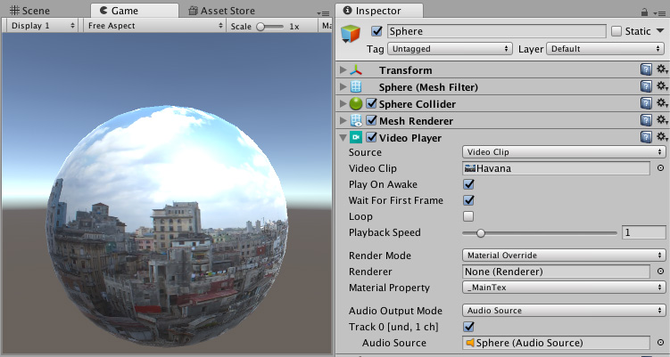

# 视频概述

使用 Unity 的视频系统可将视频集成到您的游戏中。视频素材可以增加真实感，降低渲染复杂性，或帮助您集成外部可用内容。

要在 Unity 中使用视频，请导入[视频剪辑](class-VideoClip.html)并使用[视频播放器 (Video Player) 组件](class-VideoPlayer.html)对其进行配置。系统允许您将视频素材直接提供给任何[组件](UsingComponents.html)的 __Texture__ 参数（如果该组件有此参数）。Unity 然后在运行时播放该纹理上的视频。

Unity 的视频功能包括[视频文件](VideoSources-VideoFiles.html)硬件加速解码和软件解码、[透明支持](VideoTransparency.html)、多个音频轨道以及网络流媒体。

**注意：**Unity 5.6 中引入的视频播放器组件和视频剪辑资源取代了早期的[电影纹理](class-MovieTexture.html)功能。

---

* 2017-06-15 Page published with limited [editorial review](DocumentationEditorialReview.html)

* 在 [2017.1](../Manual/30_search.html?q=newin20171) 版中添加了 PS4 视频播放器支持 NewIn20171

* Unity 5.6 中的新功能
