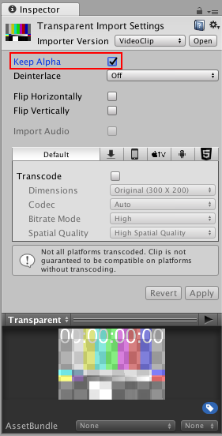

# 视频透明度支持

Unity 的[视频剪辑](class-VideoClip.html)和[视频播放器 (Video Player)](class-VideoPlayer.html) 组件支持 Alpha（这是用于指代[透明度](StandardShaderMaterialParameterAlbedoColor.html)的标准术语）。

在图形术语中，“Alpha”是“透明度”的另一种说法。Alpha 是一个连续值，而不是可以打开或关闭的选项。

最低的 Alpha 值意味着图像完全透明（根本不可见），而最高的 Alpha 值意味着它完全不透明（图像是实体的，无法透视）。中间值将使图像部分透明，允许您同时看到图像和图像背后的背景。

视频播放器组件在摄像机的近平面或远平面中播放其内容时支持全局 Alpha 值。但是，视频可具有每像素 Alpha 值，这意味着透明度在视频图像的不同位置可能会有所不同。这种每像素透明度控制是在制作图像和视频的应用程序（如 [NUKE](https://www.thefoundry.co.uk/products/non-commercial/nuke-non-commercial/) 或 [After Effects](http://www.adobe.com/products/aftereffects.html)）中进行的，而不是在 Unity Editor 中进行。

Unity 支持两种具有每像素 Alpha 的来源：

## Apple ProRes 4444

[Apple ProRes 4444 编解码器](https://support.apple.com/en-gb/HT202410)是 Apple ProRes 为 4:4:4:4 图像来源提供的极高质量版本（包括 Alpha 通道）。它提供与源视频相同级别的视觉保真度。

Apple ProRes 4444 仅支持 OSX，因为这是本机可用的唯一平台。它通常出现在 .mov 文件中。

导入使用此编解码器的视频时，通过勾选视频剪辑导入器 (Video Clip Importer) 中的相关复选框，启用 __Transcode__ 和 __Keep Alpha__ 选项。操作系统的视频播放软件可能具有识别视频使用的编解码器的功能。

在转码过程中，Unity 将 Alpha 插入颜色流中，因此可与 H.264 或 VP8 结合使用。

省略转码操作会将 ProRes 表示方法保留在资源中，这意味着目标平台必须支持此编解码器（请参阅有关视频文件兼容性的文档以了解更多信息）。

此编解码器通常还会生成大文件，因此会增加存储和带宽要求。

## Webm 与 VP8

.webm 文件格式对规范进行了改进，因此可在与 VP8 视频编解码器结合使用时携带原生的 Alpha 信息。这意味着任何 Editor 平台都可以读取使用这种透明度格式的视频。

由于 Unity 支持的大多数平台都使用软件实现方案来解码这些文件，因此不需要为这些平台进行转码。

一个需要注意的例外情况是 Android。该平台的原生 VP8 支持中不包括透明度支持，这意味着必须启用转码，以便 Unity 使用其内部 Alpha 表示方法。

---

* 2017-06-15 Page published with limited [editorial review](DocumentationEditorialReview.html)

* Unity 5.6 中的新功能
