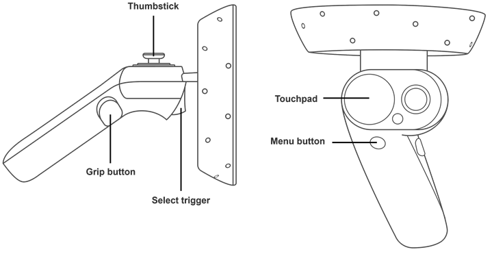

# Windows Mixed Reality 的输入

 

Windows Mixed Reality 运动控制器允许用户在混合现实应用程序中进行交互，从而允许在 Windows Mixed Reality 头盔的视野 (FOV) 内进行精确、低延迟的移动跟踪。这是使用头盔内置的传感器实现的。

为了在 Unity Editor 中实现对 Windows Mixed Reality 输入硬件的原生支持，Unity VR 子系统将三个输入作为单独的摇杆。使用 [UnityEngine.Input](../ScriptReference/Input.html) 类来读取这些输入的轴和按钮值。

## __控制器命名约定和检测__

正确配置和连接到计算机后，运动控制器在 [UnityEngine.Input.GetJoystickNames()](../ScriptReference/Input.GetJoystickNames.html) 返回的列表中显示为 __Spatial Controller - Left__ 和 __Spatial Controller - Right__。有关正确配置和连接运动控制器的信息，请参阅 [Windows 开发人员中心文档](https://developer.microsoft.com/en-us/windows/mixed-reality/motion_controllers)。

在 Unity 中，可以通过脚本定期检查摇杆名称列表中是否存在这些控制器来检查其可用性。当控制器关闭或电池被移除时，[UnityEngine.Input.GetJoystickNames()](../ScriptReference/Input.GetJoystickNames.html) 返回的列表中的控制器名称将替换为空字符串。当控制器再次开启时，控制器名称将再次出现在列表中。

## __Unity 输入系统映射__

下图显示了 Windows Mixed Reality 控制器上可用的按钮。

下表显示了 Unity 中由控制器提供的每个输入的交互类型、按钮 ID、轴和值范围。

| __硬件功能__| __交互类型__ | __Unity 按钮 ID__ | __Unity 轴 ID__ | __Unity 轴值范围__ |
|:---|:---|:---|:---|:---| 
| 触控板| 触控 | 左：18 右：19 | - | - |
| 触控板| 按压 | 左：16 右：17 | - | - |
| 触控板| 水平移动 | - | 左：17 右：19 | -1.0 到 1.0 |
| 触控板| 垂直移动 | - | 左：18 右：20 | -1.0 到 1.0 |
| 控制棒| 按压 | 左：8 右：9 | - | - |
| 控制棒| 水平移动 | - | 左：1 右：4 | -1.0 到 1.0 |
| 控制棒| 垂直移动 | - | 左：2 右：5 | -1.0 到 1.0 |
| 选择触发器| 按压 | 左：14 右：15 | - | - |
| 选择触发器| 挤压 | - | 左：9 右：10 | 0.0 到 1.0 |
| 握把按钮| 按压 | 左：4 右：5 | - | - |
| 握把按钮| 挤压 | - | 左：11 右：12 | 0.0 和 1.0* |
| 菜单按钮| 按压 | 左：6 右：7 | - | - |

Unity 的 Windows Mixed Reality 控制器输入详细信息

*握把挤压轴是二进制控制装置，因此仅报告 0 或 1 的值，没有介于两者之间的值。

下表列出了使用 Window Mixed Reality 控制器输入时可用的不同轴以及每个轴的正负方向。

| __轴__| __位置方向__ | __负方向__ |
|:---|:---|:---| 
| 水平| 向左。 | 向右。 |
| 垂直| 向上 | 向下 |

Unity 中的 Windows Mixed Reality 控制器输入轴的正负方向

有关将 Windows MR 运动控制器与 Unity 结合使用的更多详细信息，请访问 [Windows 开发人员中心关于“Unity 中的运动控制器”(Motion Controllers in Unity) 部分](https://developer.microsoft.com/en-us/windows/mixed-reality/gestures_and_motion_controllers_in_unity)。

---
* 2017-11-21 Page published with [editorial review](DocumentationEditorialReview.html)

* 2017.2 版中的新功能

