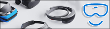
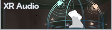
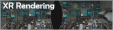
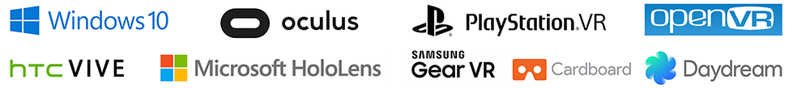

# XR

XR 是一个总括性术语，包括虚拟现实 (VR)、增强现实 (AR) 和混合现实 (MR) 应用。

本部分将概要介绍 Unity 支持的 VR、AR 和 MR SDK。每个概述部分都包含快速入门指南以及有关故障排除和最佳实践的建议。此外还可以找到有关输入和控制器映射、XR 渲染和音频以及 Unity XR API 的信息。

---

  

###[XR 概述](XR-SDK_overviews.html)###
XR 概念的概述。

 

###[VR 概述](VROverview.html)###
VR 概念的概述。

 

###[Google VR](googlevr_sdk_overview.html)###
了解 Unity 中对于 Cardboard 和 Daydream 设备的 Google VR SDK 支持。

 

###[Oculus](VRDevices-Oculus.html)###
了解 Unity 中对于 Oculus 设备的支持。

 

###[Open VR](VRDevices-OpenVR.html)
了解 Unity 中的 OpenVR SDK 支持。

 

###[Windows Mixed Reality](wmr_sdk_overview.html)
了解 Unity 中的 Windows Mixed Reality SDK 支持。

 

###[Vuforia](vuforia-sdk-overview.html)
了解 Unity 中的 Vuforia SDK 支持。

 

###[XR 输入](xr_input.html)
了解 XR API 输入系统和特定的 XR 平台交互概念。

 

###[XR 音频](VRAudioSpatializer.html)
了解 XR 中的音频概念以及如何在应用程序中实现立体声效果。

###[XR 渲染](SinglePassStereoRendering.html)
了解 XR 渲染概念。

 

###[XR 参考](VRReference.html)
了解 Unity 中的 XR API。

 

 

---
##更多资源

* [Unity 官方 XR 论坛](https://forum.unity.com/forums/ar-vr-xr-discussion.80/)
* [Unity 官方 XR 教程](https://unity3d.com/learn/tutorials/s/xr)
* [HTC Vive 开发者论坛](https://community.viveport.com/t5/Developer-Forums/ct-p/developers)
* [官方 Oculus 开发者文档](https://developer.oculus.com/documentation/)
* [Windows Mixed Reality 开发人员中心文档](https://developer.microsoft.com/en-us/windows/mixed-reality)
* [Google VR Unity 开发者文档和指南](https://developers.google.com/vr/develop/unity/get-started-android)
* [Vuforia 开发者文档和指南](https://library.vuforia.com/getting-started)

---

 
