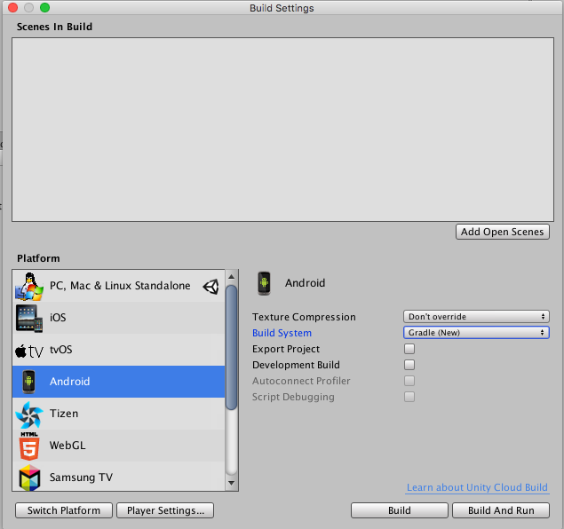
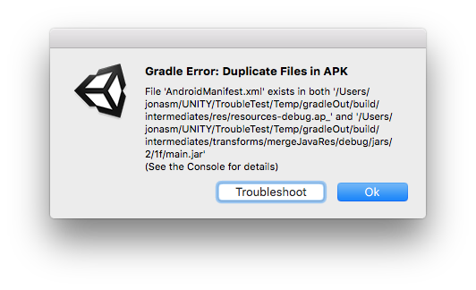

# Gradle for Android

Gradle 是一种可自动执行许多构建过程的 Android 构建系统。这种自动化意味着不太可能发生许多常见的构建错误。最值得注意的是，在 Unity 中，该系统可减少 DEX（Dalvik 可执行文件格式）文件中的方法引用数量，这意味着可降低遇到 DEX 限制问题的可能性。但是，由于 Gradle 与默认的 Unity Android 构建系统之间存在差异，一些现有项目可能很难转换为 Gradle。

您可以使用 Unity 中的 Gradle 构建系统构建输出包 (APK)，也可以导出 Gradle 项目并在外部工具（如 Android Studio）中进行构建。

如需了解更多信息，请参阅 Gradle 的 [Gradle for Android 构建入门 (Getting Started with Gradle for Android Build)](https://gradle.org/getting-started-android-build/) 参考资源。

## 使用 Gradle for Android 进行构建

要在 Unity 中使用 Gradle 进行 Android 版本的构建，请执行以下操作：

1.在 Unity Editor 中，打开 [Build Settings](BuildSettings.html) 窗口（菜单：__File__ &gt; __Build Settings...__）
2.在 __Platform__ 列表中，选择 __Android__
3.在 Build System 下拉选单中选择 __Gradle (new)__，然后单击 __Build__

## 导出 Gradle 项目

要导出 Gradle 项目，请按照上面的说明操作，但要先在 Build 窗口中勾选 __Export Project__ 选项再单击 __Build__。单击 __Build__ 时，Unity 会在指定目录中生成 Gradle 项目，而不是构建 APK。可将此项目导入 Android Studio 以进行其他修改或完全控制构建过程。

有关构建输出包 (APK) 的更多信息，请参阅 [Android Studio 的构建配置文档](https://developer.android.com/studio/build/index.html)。

## 提供自定义的 build.gradle 模板

要在 Unity 中构建 APK 时使用您自己的 build.gradle 文件，请选中 [Player Settings](class-PlayerSettingsAndroid.html) 下的 Custom Gradle Template 复选框。
这样便会生成一个默认的 mainTemplate.gradle，而您可以对其进行编辑。此模板包含几个将由 Unity 构建过程填入的变量，例如 `**TARGETSDKVERSION**`，通常不需要理会这些变量。
您也可以通过相同的方式在 Plugins 目录中提供一个 settingsTemplate.gradle（但目前没有自动方式来执行此操作），从而使用您自己的 settings.gradle。此文件负责包含您的库项目，因此除非您还想覆盖该过程，否则此文件至少应包含以下行：

`**INCLUDES**`

该行将被所有库的 include 指令替换。

###模板变量
可在 mainTemplate.gradle 文件中使用以下变量：

|**变量：** |**描述：** |
|:---|:---|
|__DEPS__| 项目依赖项（即，使用的库）的列表。 |
|__API VERSION__ | 构建针对的 API 版本（如 25）。 |
|__BUILDTOOLS__| 使用 SDK 构建工具（如 25.0.1）。 |
|__TARGETSDKVERSION__ | 目标 API 版本（如 25）。 |
|__APPLICATIONID__ | Android 应用程序 ID（如 com.mycompany.mygame）。 |
|__MINIFY_DEBUG__| 允许为调试版本缩小（true 或 false）。 |
|__PROGUARD_DEBUG__ | 使用 proguard 进行缩小（true 或 false）。 |
|__MINIFY_RELEASE__ | 允许为发布版本缩小（true 或 false）。 |
|__PROGUARD_RELEASE__| 使用 proguard 进行缩小（true 或 false）。 |
|__USER_PROGUARD__ | 自定义用户 proguard 文件（即 progard-user.txt）。 |
|__SIGN__ | 如果要签署构建，完成 signingConfigs 部分。 |
|__SIGN_CONFIG__ | 如果已签署构建，设置为“signingConfig signingConfig.release”。 |
|__DIR_GRADLEPROJECT__ | 创建 Gradle 项目的目录。 |
|__DIR_UNITYPROJECT__ | Unity 项目的目录。 |

###缩小
可在 [Player Settings](class-PlayerSettingsAndroid.html) Minify 下激活 **Proguard Minification**。
请注意，proguard 会很容易移除实际需要的代码，因此通常需要小心配置此过程。作为起点，可使用相同设置下的 User Proguard File 复选框来生成自定义的 proguard.txt。

请参阅 [ProGuard 手册](https://www.guardsquare.com/en/proguard/manual/usage)以了解有关 Proguard 的更多信息。

## 使用 Gradle 进行构建时的错误

如果在使用 Gradle 进行 Android 版本构建期间发生错误，Unity 将显示错误对话框。单击 __Troubleshoot__ 即可在系统的浏览器中打开有关 [Gradle 故障排除](android-gradle-troubleshooting.html)的 Unity 文档。

---

*  2017-10-02  Page published with limited [editorial review](DocumentationEditorialReview.html)

* 扩展了自定义 build.gradle 模板部分。

* 5.5 中的新功能
