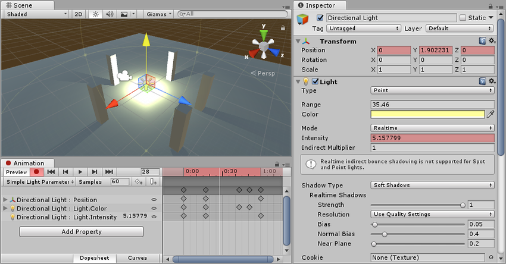
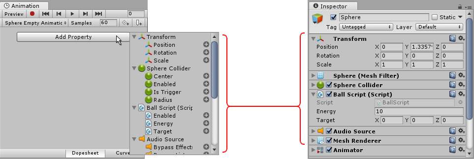
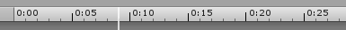
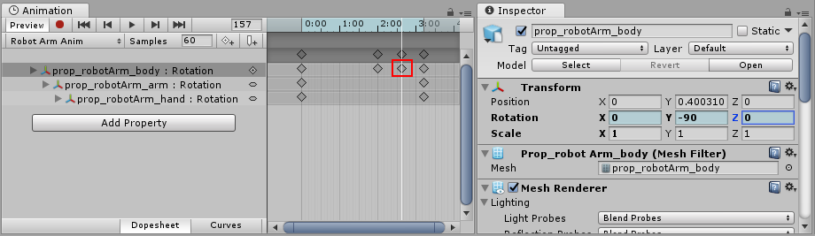

#动画化游戏对象

保存新的动画剪辑资源后，即可开始向剪辑添加关键帧。

您可以使用两种不同方法在 Animation 窗口中对游戏对象进行动画化：**录制模式**和**预览模式**。

**录制模式**（也称为自动关键点模式）

在录制模式下，当您移动、旋转或以其他方式修改动画游戏对象的任何可动画属性时，Unity 会自动在回放头处创建关键帧。按下带有红色圆圈的按钮即可启用录制模式。在录制模式下，Animation 窗口时间轴**显示为红色**。

**预览模式：**

在预览模式下，修改动画游戏对象*不会*自动创建关键帧。每次将游戏对象修改为所需的新状态（例如，移动或旋转它）时，您必须手动创建关键帧（见下文）。按下 **Preview** 按钮即可启用预览模式。在预览模式下，Animation 窗口时间轴**显示为蓝色**。

*注意：在录制模式下，**Preview** 按钮也处于活动状态，因为您在预览现有动画的同时也会录制新的关键帧。*

## 录制关键帧

要开始录制所选游戏对象的关键帧，请单击 __Animation Record__ 按钮。随后将进入__动画录制模式__。在此模式中，对游戏对象的更改将被录制到__动画剪辑__中。

进入__录制模式__后，可通过将白色的回放头设置到动画时间轴中需要创建关键帧的位置，然后将游戏对象修改为您希望它在该时间点所处的状态。

对游戏对象所做的更改将在 Animation 窗口中白线（回放头）所示的当前时间录制为关键帧。

对可动画属性（例如其位置或旋转）所做的任何更改都将使该属性的关键帧出现在 Animation 窗口中。

单击或拖动时间轴栏会移动回放头并显示回放头所在时间点的动画状态。

在以下截屏中，您可以看到录制模式下的 Animation 窗口。时间轴栏显示为红色，表示处于录制模式，动画属性在检视面板中以红色背景显示。

您可以通过再次单击 __Record__ 按钮来随时停止__录制模式__。停止录制模式时，Animation 窗口将切换到__预览模式__，因此仍然可以根据动画时间轴看到游戏对象处于其当前位置。

您可以在动画录制模式下通过操作游戏对象的任何属性来动画化该属性。移动、旋转或缩放游戏对象会为动画剪辑中的这些属性添加相应关键帧。在录制模式下，直接在游戏对象的检视面板中调整值也会添加关键帧。此情况适用于检视面板中的任何可动画属性，包括数值、复选框、颜色和大多数其他值。

游戏对象当前已动画化的所有属性都显示在 Animation 窗口左侧。未动画化的属性不会显示在此窗口中。要动画化的所有新属性（包括子对象上的属性）都会在您开始动画化时立即添加到属性列表区域。

__Transform__ 属性的特别之处在于 __.x__、__.y__ 和 __.z__ 属性已链接，因此会同时添加所有这三个属性的曲线。

还可以通过单击 __Add Property__ 按钮将可动画属性添加到当前游戏对象（及其子项）。单击此按钮可显示游戏对象的可动画属性的弹出列表。这些属性与在检视面板中列出的属性相对应。

在__预览模式__或__录制模式__下，白色竖线显示当前预览的__动画剪辑__帧。__Inspector__ 和 __Scene 视图__会显示处于该动画剪辑帧的游戏对象。该帧的动画属性值也显示在属性名称右侧的列中。

在动画模式中，白色竖线显示当前预览的帧。

###时间轴
您可以单击 __Animation 窗口时间轴__上的任意位置，将回放头移动到该帧，然后在动画剪辑中预览或修改该帧。__时间轴__中的数字显示为秒和帧，因此 1:30 表示 1 秒和 30 帧。

*注意，Animation 窗口中的此__时间轴__栏与 **Timeline 窗口***共用相同名称，但独立于该窗口

注意：时间轴在处于_预览_模式时**显示为蓝色**，处于_录制_模式时**显示为红色**。

###在预览模式下创建关键帧

除了在修改游戏对象时使用__录制模式__来自动创建关键帧，还可以修改游戏对象上的属性，然后明确选择为该属性创建关键帧，从而在__预览模式__中创建关键帧。

在预览模式中，动画属性在 Inspector 窗口中显示为蓝色。当您看到此蓝色时，表示这些值由当前在 Animation 窗口中预览的动画剪辑的关键帧驱动。

如果在预览时修改任意的这些蓝色属性（例如旋转具有旋转属性动画的游戏对象，如以上截屏所示），游戏对象现在将处于**已修改的**动画状态。此状态通过检视面板字段变色为粉红色来指示。因为当前未处于录制模式，所以当前的修改尚未保存为关键帧。

例如，在以下截屏中，旋转属性的 Y 值已修改为 -90。此修改尚未保存为动画剪辑中的关键帧。

在此修改状态下，必须手动创建关键帧来“保存”此修改。如果移动回放头，或将选择焦点从动画游戏对象上移开，您将失去此修改。

###手动创建关键帧

在预览模式下修改游戏对象后，有三种不同方法可手动创建关键帧。

您可以通过右键单击已修改属性的__属性标签__来添加关键帧，这样就可以仅为该属性或为所有动画属性添加关键帧：

添加关键帧后，新关键帧将在 Animator 窗口中显示为菱形符号（在以下截屏中以红色标注），而属性字段将恢复蓝色，表示您的修改已保存为关键帧以及您现在正在预览由动画关键帧驱动的值。

您还可以通过单击 Animation 窗口中的 __Add Keyframe__ 按钮来添加关键帧：

或使用热键 K 或 Shift-K 来添加一个或多个关键帧，如下所述：

####热键

* **K** - *为所有动画属性添加关键帧。*在 Animation 窗口回放头的当前位置为所有动画属性添加关键帧。
* **Shift-K** - *为所有已修改属性添加关键帧。*在 Animation 窗口回放头的当前位置仅为已修改的动画属性添加关键帧。

---
* 2017-09-05 Page amended with limited [editorial review](DocumentationEditorialReview.html)

* 在 Unity [2017.1](https://docs.unity3d.com/2017.1/Documentation/Manual/30_search.html?q=newin20171) 中添加预览模式 NewIn20171
