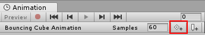

#使用动画曲线

##属性列表

在__动画剪辑__中，任何可动画属性都可以具有__动画曲线__，这意味着动画剪辑控制着该属性如何随时间推移而变化。在 __Animation 视图__的属性列表区域（左侧）中，会列出所有当前已动画化的属性。Animation 视图处于关键帧清单模式时，每个属性的动画值仅显示为线性轨迹，但在曲线模式中，变化的属性值会被可视化为图上的线条。无论使用哪种视图模式，曲线均存在；不同之处在于，关键帧清单模式只提供仅在关键帧出现时显示的数据的简化视图。

在__曲线__模式中，__动画曲线__具有彩色曲线标记，每种颜色代表属性列表中当前所选属性之一的值。有关如何将曲线添加到动画属性的信息，请参阅有关[使用 Animation 视图](animeditor-UsingAnimationEditor.html)的部分。

##了解曲线、关键点和关键帧

__动画曲线__具有多个__关键点__，这些关键点是曲线路径上的控制点。这些点在__曲线编辑器__中显示为曲线上的小菱形。如果一个帧在一条或多条曲线中具有__关键点__，则该帧称为__关键帧__。

如果某个属性在当前预览的帧中具有__关键点__，则曲线轨迹上将有一个菱形标记，并且属性列表也将在该值旁边出现一个菱形标记。

__曲线编辑器__仅会显示所选属性的曲线。如果在属性列表中选择多个属性，则曲线将叠加在一起显示。

##添加和移动关键帧

 

您可以通过单击 __Keyframe__ 按钮在当前预览的帧中添加__关键帧__。

可通过单击 __Keyframe__ 按钮在当前预览的帧中添加__关键帧__。此操作将为所有当前选定的曲线添加关键帧。还有一种方法可将关键帧添加到任何给定帧的单条曲线，只需双击应该添加新__关键帧__的曲线。此外，也可以通过右键单击__关键帧线__并从上下文菜单中选择 __Add Keyframe__ 来添加__关键帧__。添加__关键帧__后，可使用鼠标将其四处拖动。另外，还可选择一次拖动多个__关键帧__。通过选中__关键帧__并按 __Delete__ 或者通过右键单击关键帧并从上下文菜单中选择 __Delete Keyframe__，即可删除关键帧。

##支持的可动画属性

__Animation 视图__可用于动画化更多属性，而不仅限于__游戏对象__的位置、旋转和缩放。您可以动画化任何__组件__和__材质__的属性，甚至是您自己的脚本组件的公共变量。若要生成具有复杂视觉效果和行为的动画，只需为相关属性添加__动画曲线__。

动画系统支持以下类型的属性：

* Float
* Color
* Vector2
* Vector3
* Vector4
* Quaternion
* Boolean

不支持数组，也不支持以上列表以外的结构体和对象。

对于布尔值属性，值为 __0__ 等于 __False__，而其他任何值等于 __True__。

以下是 __Animation 视图__的多种用途的几个示例：

* 动画化__光照__的__颜色__和__强度__，从而使其闪烁、闪光或跳动。
* 动画化循环__音频源__的__音高__和__音量__，从而在将声音资源的大小保持在最低限度的同时，使吹风、运行的引擎或流水变得生动。
* 动画化__材质__的__纹理偏移__，从而模拟移动的皮带或轨道、流水或特效。
* 动画化多个__椭圆粒子发射器__的__发射__状态和__速度__，从而生成壮观的烟花或喷泉表演特效。
* 动画化您自己的脚本组件的变量，使事物随着时间推移而有不同行为。

使用__动画曲线__来控制游戏逻辑时，请注意 Unity 中[回放和采样](AnimationScripting.html)动画的方式。

##旋转插值类型

旋转在 Unity 内部用__四元数__的形式表示。四元数包含 __.x__、__.y__、__.z__ 和 __.w__ 值。除非对这些值的作用非常熟悉，否则通常不应手动修改这些值。一般应使用__欧拉角__来操作旋转。欧拉角具有 __.x__、__.y__ 和 __.z__ 值，表示围绕这三个相应轴进行的旋转。

在两个旋转之间进行插值时，可对__四元数__值或__欧拉角__值执行插值。__Animation 视图__可让您选择在动画化__变换__旋转时使用哪种插值形式。但是，无论使用哪种插值形式，旋转始终以__欧拉角__值形式显示。

###四元数插值

四元数插值总是沿两个旋转之间的最短路径产生平滑的旋转变化。这样可避免产生旋转插值瑕疵，例如万向锁 (Gimbal Lock)。然而，四元数插值总是寻找最短路径，因此不能表示大于 180 度的旋转。（为了理解这一点，您可以想象在球体表面上选取两个点，这两个点之间的最短路径永远不会超过球体周长的一半）。

如果使用四元数插值并将旋转数值设置为相隔 180 度以上，则 Animation 窗口中绘制的曲线仍将显示超过 180 度的覆盖范围，但是对象的实际旋转将采用最短路径。

 

对旋转使用四元数插值时，更改任意 x、y 或 z 曲线的关键点或切线也可能会更改其他两条曲线的值，因为所有三条曲线都是从内部四元数表示中创建的。使用四元数插值时，关键点始终为链接状态，因此在特定时间为三条曲线（x、y 或 z）中的任一条曲线创建关键点也将在此时间为其他两条曲线创建关键点。

###欧拉角插值

欧拉角插值是大多数人习惯使用的方法。欧拉角可表示任意范围的旋转，并且 __.x__、__.y__ 和 __.z__ 曲线相互独立。同时围绕多个轴旋转时，欧拉角插值可能容易出现万向锁之类的瑕疵，但如果一次围绕一个轴进行简单旋转，使用起来会很直观。使用欧拉角插值时，Unity 在内部将曲线烘焙到内部使用的四元数表示中。这类似于将动画从外部程序导入 Unity 时发生的情况。请注意，此曲线烘焙可能会在过程中添加额外关键点，并且切线类型为__常量__的切线在子帧级别可能不完全准确。
