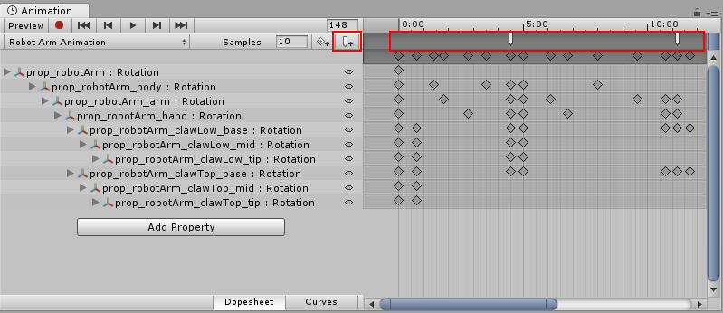
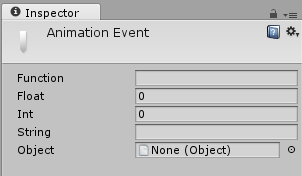
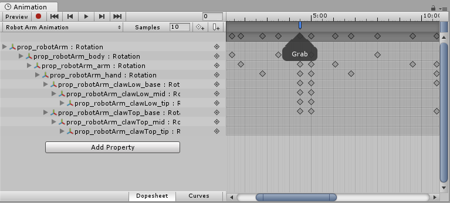
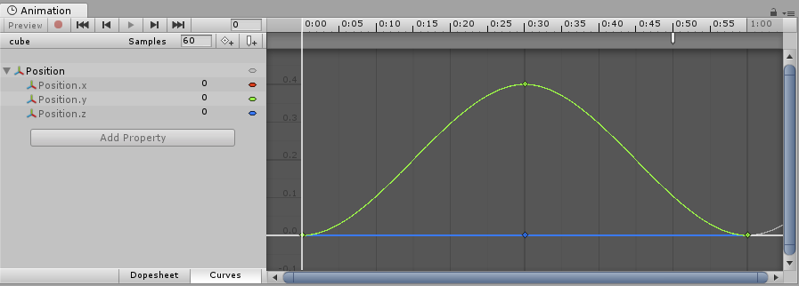

#使用动画事件

您可以使用动画事件增加动画剪辑的实用性。动画事件允许您在时间轴中的指定点调用对象脚本中的函数。

由动画事件调用的函数也可以接受一个参数。该参数可以是 `float`、`string`、`int` 或 `object` 引用或 AnimationEvent 对象。AnimationEvent 对象具有一些成员变量，通过这些变量可将浮点、字符串、整数和对象引用以及有关触发函数调用的事件的其他信息一次性传递给该函数。

````
// 此 C# 函数可由动画事件调用
public void PrintFloat (float theValue) {
	Debug.Log ("PrintFloat is called with a value of " + theValue);
}
````

要将动画事件添加到当前播放头位置的剪辑，请单击 __Event__ 按钮。要将动画事件添加到动画中的任何点，请在要触发事件的时间点上双击__事件__线。添加事件后，可拖动鼠标重新定位该事件的所在位置。要删除事件，请选择该事件并按 __Delete__ 键，或右键单击该事件并选择 __Delete Event__。



添加事件时，Inspector 窗口会显示多个字段。这些字段可指定要调用的函数的名称以及要传递给它的参数值。



添加到剪辑的事件在事件线中会显示一个标记。在标记上悬停鼠标可显示带有函数名称和参数值的工具提示。

 

您可以在时间轴中选择和操作多个事件。

要在时间轴中选择多个事件，请按住 **Shift** 键并逐个选择事件标记，从而将它们添加到您的选择中。您也可以在它们之间拖动一个选择框；在事件标记区域内单击并拖动，如下所示：

 


##示例

以下示例演示如何将动画事件添加到简单的游戏对象。执行所有步骤后，立方体会在播放模式期间沿 x 轴向前和向后进行动画化，并在 0.8 秒时间处每隔 1 秒在控制台中显示事件消息。

该示例需要一个包含 `PrintEvent()` 函数的小脚本。此函数打印一条调试消息，其中包含一个字符串（“called at:”）和时间：

````
// 此 C# 函数可由动画事件调用
using UnityEngine;
using System.Collections;


public class ExampleClass : MonoBehaviour {
	public void PrintEvent(string s) {
		Debug.Log("PrintEvent: " + s + " called at: " + Time.time);
	}
}
````

使用此示例代码创建一个脚本文件，并将其放在 Project 文件夹中（在 Unity 的 Project 窗口内右键单击，并选择 __Create__ > __C# Script__，然后将以上代码示例复制并粘贴到该文件并保存）。

在 Unity 中，创建立方体游戏对象（菜单：__GameObject__ > __3D Object__ > __Cube__）。要将新脚本文件添加到该立方体，请将文件从 Project 窗口拖放到 Inspector 窗口。

选择立方体，然后打开 Animation 窗口（菜单：__Window__ > __Animation__）。为 x 坐标设置__位置__曲线。



接下来，设置 x 坐标的动画，增加到大约 0.4 秒，然后在 1 秒内恢复到零，再随后在大约 0.8 秒处创建动画事件。按 Play 即可运行动画。
