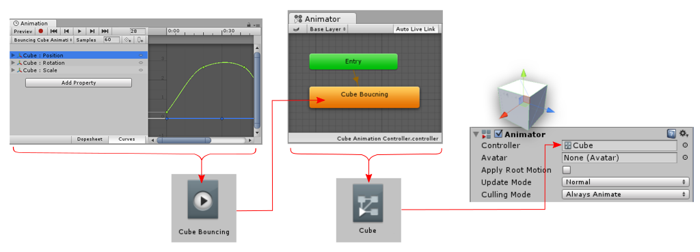
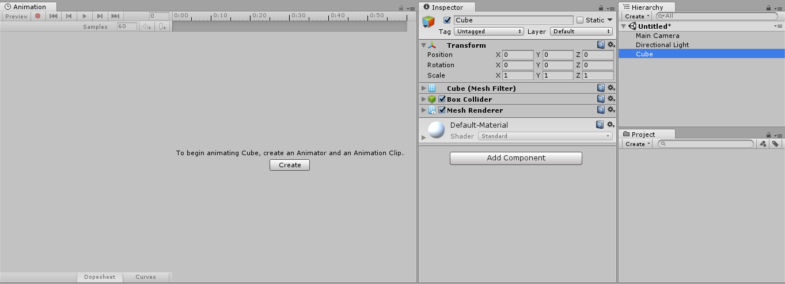

#创建新动画剪辑

要在 Unity 中对游戏对象进行动画化，对象需要附加 __Animator 组件 (Animator Component)__。此 Animator 组件必须引用 __Animator Controller__，后者进一步包含对一个或多个__动画剪辑 (Animation Clips)__ 的引用。

使用 Animation 视图开始在 Unity 中对游戏对象进行动画化时，系统将自动为您创建、附加和设置所有这些项。

为选定游戏对象创建新的__动画剪辑__，并确保 __Animation 窗口__可见。

如果游戏对象尚未分配任何动画剪辑，您将在 Animation 窗口时间轴区域的中心位置看到“Create”按钮。单击 Create 按钮。然后，系统会提示您将新的空动画剪辑保存在 __Assets__ 文件夹中的某个位置。

保存这个新的空动画剪辑后，系统会自动执行以下若干操作：

* 创建新的 Animator Controller 资源
* 创建的新剪辑将以默认状态添加到Animator Controller中
* Animator组件将添加到要动画化的游戏对象
* 为Animator组件分配新的Animator Controller

此自动操作序列的结果已为您设置好动画系统所有必需的元素，因此您现在可以开始动画化对象。

##添加另一动画剪辑

如果已经为游戏对象分配一个或多个动画剪辑，“Create”按钮将不可见。此情况下，这些剪辑的其中之一将在 Animation 窗口中可见。您可以使用 Animation 窗口左上角的菜单（就在播放控件下方）来切换窗口中可见的动画剪辑。

如果要在已具有动画的对象上创建新的动画剪辑，必须从此菜单中选择“Create New Clip”。系统将再次提示您保存新的空动画剪辑，然后才可以使用该动画剪辑。

##如何整合到一起

虽然上述步骤会自动设置相关组件和引用，但了解哪些部件必须连接在一起会很有用。

* 游戏对象必须有__Animator__组件
* 必须为Animator组件分配__Animator Controller__资源
* 必须为Animator Controller资源分配一个或多个动画剪辑

下图以 Animation 窗口中创建新动画剪辑为起点，展示了如何分配这些部件：

 

在下图中，您可以看到一个尚未动画化的游戏对象（“Cube”）被选中。当前，我们只有一个不带Animator组件的简单立方体。为清晰起见，Animation、Hierarchy、Project 和 Inspector 窗口以并排方式排列。

通过按下 Animation 视图中的 Create 按钮创建新的动画剪辑。Unity 将要求选择名称和位置来保存这个新的动画剪辑。Unity 还会创建一个与所选游戏对象同名的Animator Controller资源，将Animator组件添加到游戏对象，并适当地连接资源。

在以上新视图中，您可以看到：

* Animation 窗口（左上角）现在显示带有白色回放头线的时间轴，表明已准备好录制新的关键帧。该剪辑的名称显示在剪辑菜单中，位于回放控件下方。
* Inspector（中心位置）显示 Cube 游戏对象现在已添加__Animator组件__，该组件的“Controller”字段显示已分配一个名为“Cube”的Animator Controller资源
* Project 窗口（右下角）显示已创建两个新资源：一个名为“Cube”的Animator Controller资源和一个名为“Cube Animation Clip”的动画剪辑资源
* Animator 窗口（左下角）显示Animator Controller的内容：您可以看到 Cube Animation Clip 已添加到控制器，并处于“默认状态”（以橙色指示）。添加到控制器的后续剪辑将呈灰色，表示它们不是默认状态。

---
* 2017-09-05 Page amended with limited [editorial review](DocumentationEditorialReview.html)

