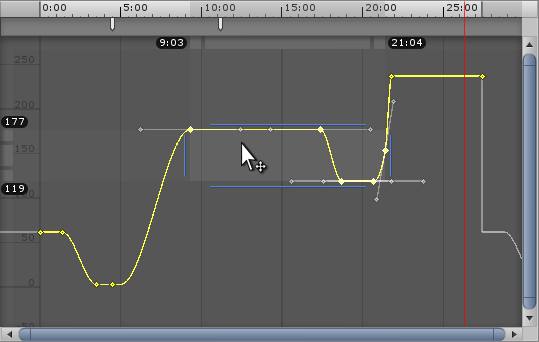
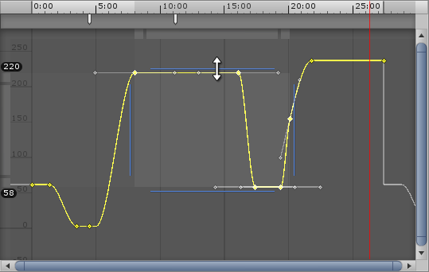

#曲线模式中的关键点操作

在__曲线__模式中查看 Animation 窗口时，可通过框选方式选择多个关键点。通过此功能可一次选择和操作多个关键点。

通过以下操作可选择多个关键点：

* 按住 Shift 并单击，将每个所需的关键点添加到您的选集
* 使用鼠标拖动一个矩形，选择一组关键点
* 按住 Shift 并拖动一个矩形，在当前选集内添加或删除一组关键点

在向选集内添加关键点时，框选控制柄将出现在所选关键点的任一侧以及顶部和底部。如果在选集内添加或删除更多关键点，控制柄会自动调整位置和大小以便包含所有当前选定关键点。

## 移动所选关键点

单击框选控制柄内的任意位置可拖拽和移动所选关键点。无需直接单击关键点即可执行此操作；您可以通过单击框选控制柄内的空白位置来进行拖动。

拖动时，第一个关键点和最后一个关键点的时间会显示在时间轴栏下以便帮助您将关键点放在所需位置。向左拖动所选关键点时，如果松开鼠标按钮，以负时间结束（即位于时间轴上 0 标记的左侧）的任何关键点都会被删除。

##缩放所选关键点

选择多个关键点后，可__缩放__所选关键点。在曲线模式下，您可以水平缩放以更改关键点的时间位置，也可以垂直缩放以更改关键点的值。

### 水平缩放所选关键点

使用所选关键点左右侧的框选控制柄可水平缩放选集。这会更改关键点的时间位置而不修改其值。将控制柄拉开即可将关键点拉伸更长的一段时间（使所选动画更慢），或将它们推得更靠近以便将关键点置于更短的一段时间范围（使所选动画更快）。

在水平缩放选集时，关键点的最小和最大时间会显示在视图顶部以帮助您将选集设置为所需时间。

### 垂直缩放所选关键点

使用所选关键点顶部和底部的框选控制柄可垂直缩放选集。这会更改关键点的值而不修改其时间位置。

在垂直缩放选集时，关键点的最小和最大值显示在视图左侧以帮助您将选集设置为所需值。

## 操作栏

除了所选关键点周围出现的框选控制柄，__Curves__ 窗口的顶部和左侧还有灰色操作栏，它们提供了操作当前选集的额外方法。

顶部的操作栏允许您修改所选关键点的时间位置，并保持其值不变。侧面的操作栏允许您修改所选关键点的值，并保持其时间位置不变。

选择多个关键点后，顶部和左侧的操作栏在每端显示一个方块。拖动操作栏的中心位置可移动所选关键点（水平或垂直方向），而拖动每个操作栏每端的方块可缩放所选关键点。

就像框选控制柄一样，使用灰色操作栏移动或缩放所选关键点时，会显示最小值和最大值或关键帧时间。对于时间操作栏（在窗口顶部），显示的是第一个和最后一个关键帧的时间。对于值操作栏（在窗口左侧），显示的是关键点的最小和最大值。

**注**：仅当选择多个关键点时，操作栏每端的缩放框才可见，并且视图会充分放大，使操作栏足够长以便显示每端的缩放框。

##波纹编辑

波纹编辑 (Ripple editing) 是一种用于移动和缩放所选关键点的方法。此方法还会影响与您正在操作的关键点位于同一时间轴上的非选定关键点。此方法的名称表示让其他内容自动沿时间轴移动以适应您添加、扩展或缩减的内容。编辑结果在整个时间轴上具有“波纹效应”。

按住 __R__ 键的同时在框选范围内拖动即可执行__波纹移动 (Ripple Move)__。沿着时间轴拖动所选关键点时，此操作会产生将任何非选定关键点（以及选集与非选定关键点之间的原始空间量）“推动”到选集左侧或右侧的效果。

按住 __R__ 键的同时拖动框选控制柄即可执行__波纹缩放 (Ripple Scale)__。对时间轴中其余非选定关键点的影响与波纹移动操作完全相同：当缩放到框选范围左侧或右侧时，会将非选定关键点推向左侧或右侧。
