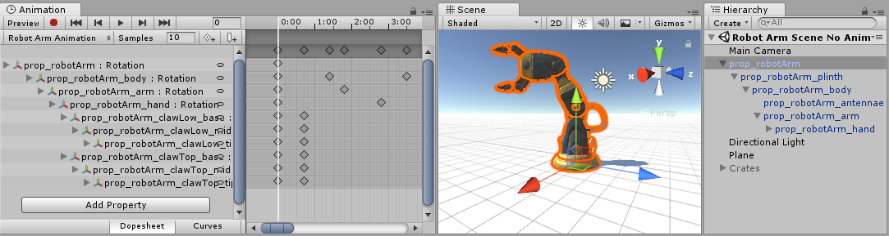
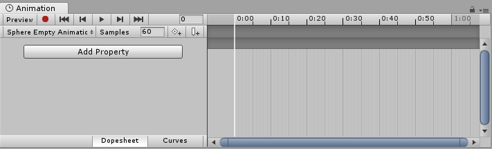
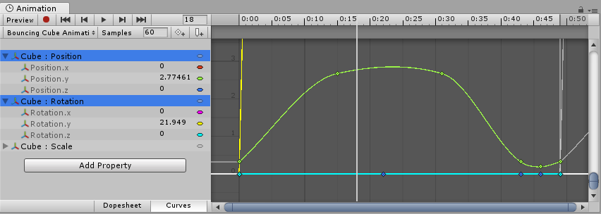

#使用 Animation 视图

__Animation 视图__用于预览和编辑 Unity 中已动画化的__游戏对象__的__动画剪辑__。要在 Unity 中打开 Animation 视图，请选择 __Window__ > __Animation__。

##查看游戏对象上的动画

__Animation 窗口__与 Hierarchy 窗口、Project 窗口、Scene 视图和 Inspector 窗口相关联。与 Inspector 一样，Animation 窗口显示当前所选游戏对象或动画剪辑资源的动画时间轴和关键帧。您可以使用 Hierarchy 窗口或 Scene 视图来选择游戏对象，或使用 Project 窗口来选择动画剪辑资源。

注意：Animation 视图独立于 [Timeline 窗口](TimelineSection.html)，但是看起来类似于此窗口。

##已动画化的属性列表

在下图中，Animation 视图（左）显示当前所选游戏对象及其子游戏对象（如果它们也受此动画控制）所使用的动画。Scene 视图和 Hierarchy 视图在右侧，展示了 Animation 视图中显示已附加到当前所选游戏对象的动画。

 

Animation 视图的左侧列出已动画化的属性。在尚未录制任何动画的新建剪辑中，此列表为空。

开始动画化此剪辑中的各种属性时，已动画化的属性将显示在此处。如果该动画控制多个子对象，列表中还将包括每个子对象的动画属性的分层子列表。在以上示例中，机械臂 (Robot Arm) 的游戏对象层级视图的各个部分都在同一动画剪辑中进行动画化。

当像这类在单个剪辑中需要对整个游戏对象层级视图进行动画化时，需确保在层级视图的根游戏对象上创建动画。

每个属性都可折叠和展开以显示每个关键帧记录的确切值。如果回放头（白线）位于关键帧之间，则值字段显示插值结果。您可以直接编辑这些字段。如果在回放头位于关键帧之上的情况下进行了更改，则会修改该关键帧的值。如果回放头位于关键帧之间的情况下进行了更改（因此显示的值是插值），则会在该点使用您输入的新值来创建新的关键帧。

##动画时间轴

Animation 视图的右侧是当前剪辑的时间轴。每个动画属性的关键帧都显示在此时间轴中。时间轴视图有两个模式：__关键帧清单 (Dopesheet)__ 模式和__曲线 (Curves)__ 模式。要在这些模式之间切换，请单击动画属性列表区域底部的 __Dopesheet__ 或 __Curve__：

 

它们提供动画时间轴和关键帧数据的两个交替视图。

###关键帧清单时间轴模式

__关键帧清单__模式提供更紧凑视图，允许您在单个水平轨道中查看每个属性的关键帧序列。因此，您可以查看多个属性或游戏对象的关键帧时间的概况。

请参阅有关[关键帧清单模式中的关键点操作](animeditor-AdvancedKeySelectionAndManipulation.html)的文档以了解更多信息。

###曲线时间轴模式

__曲线__模式显示一个可调整大小的图形，其中包含每个动画属性的值如何随时间变化的视图。所有选定属性都叠加显示在同一图形中。在此模式下，您可以很好地控制属性值的查看和编辑，以及如何在两者之间进行插值。

###使选择对象适应窗口

使用__曲线__模式来查看动画时，必须了解有时每个属性的各种范围会有很大差异。例如，考虑一个用于旋转弹跳立方体的简单动画剪辑。弹跳 Y 位置值可在 0 到 2 的范围之间变化（意味着在动画期间立方体弹跳高度为 2 个单位）；但是，旋转值的范围是从 0 到 360（表示其旋转度数）。同时查看这两条曲线时，位置值的动画曲线将很难显示出来，因为视图将缩小以适应窗口内旋转值的 0-360 范围：

按键盘上的 __F__ 即可将视图缩放到当前选定的关键帧。这是一种有用的快捷方式，能够在一部分动画时间轴上聚焦和重新缩放窗口以便于编辑。

 

单击列表中的各个属性，然后按键盘上的 __F__ 可自动重新缩放视图以适合该值的范围。此外，还可使用视图滚动条滑块每端的拖动控制柄来手动调整 __Curves__ 窗口的缩放。下图为放大后的 Animation 窗口以便查看弹跳的 Y 位置动画。黄色旋转曲线的起点仍然可见，但曲线现在已超出视图顶部位置：

 

按键盘上的 __A__ 可适应并重新缩放窗口，从而显示剪辑中的所有关键帧（无论选择哪些帧）。如果要在保留当前选择的同时查看整个时间轴，此操作非常有用：

 

###回放和帧导航的控制

要控制__动画剪辑__的回放，请使用 Animation 视图左上方的__回放控制__。

从左到右，这些控制按钮是：

* 预览模式（切换开/关）
* 录制模式（切换开/关）*注意：如果打开录制模式，则预览模式也会始终打开*
* 将回放头移到剪辑的开头
* 将回放头移到上一关键帧
* 播放动画
* 将回放头移到下一关键帧
* 将回放头移到剪辑的结尾

还可使用以下键盘快捷键来控制回放头：

* 按__逗号__ (__,__) 跳到上一帧。
* 按__句号__ (__.__) 跳到下一帧。
* 按住 Alt 并按下__逗号__ (__,__) 跳到上一__关键帧__。
* 按住 Alt 并按下__句号__ (__.__) 跳到下一__关键帧__。

###锁定窗口

您可以锁定 Animation 编辑器窗口，使其不会自动切换来反映 Hierarchy 或 Scene 视图中当前选择的游戏对象。如果希望在专注于某个特定游戏对象的动画的同时，仍然能够选择和操作 Scene 视图中的其他游戏对象，则锁定窗口会非常有用。

要了解有关 Curve 视图导航的更多信息，请参阅[使用动画曲线](animeditor-AnimationCurves.html)文档。

---
* 2017-09-05 Page amended with limited [editorial review](DocumentationEditorialReview.html)

