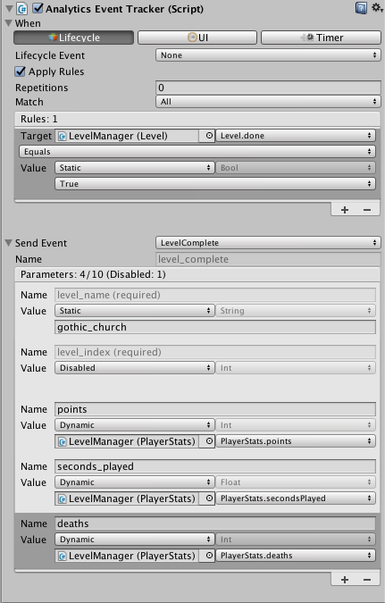
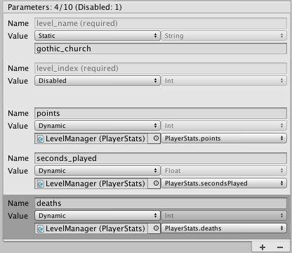

# Analytics Event Tracker

使用 __Analytics Event Tracker__ 组件可发送标准事件和自定义事件。虽然可以使用脚本发送这些事件，但在某些情况下，直接从 Unity Editor 的 Inspector 窗口中设置事件触发器和参数会更方便。

将 Analytics Event Tracker 组件附加到任何游戏对象以便发送标准事件或自定义事件。对于要发送的每种不同类型的 Analytics 事件，应使用单独的跟踪器组件。

Analytics Event Tracker 组件包含两个重要部分：

* **When**：指定分发事件的时间。
* **Send Event**：指定要发送的事件，并定义必需和可选的参数。

## 发送事件的时间

可通过三种方式触发跟踪器组件发送事件：__Lifecycle Event__、__UI__ 和 __Timer__。

* 选择 __Lifecycle Event__ 可在发生特定的 `MonoBehaviour` 生命周期事件（如 `Start` 或 `OnEnable`）时分发 Analytics 事件。
* 如果要使用 UI 事件来触发 Analytics 事件，请选择 __UI__。必须单独设置 UI 事件。例如，要在单击按钮时分发事件，可将 `AnalyticsEventTracker.TriggerEvent` 添加到按钮的 `OnClick()` 列表中：

* 选择 __Timer__ 可在指定的延迟后或定期（以秒为单位）分发 Analytics 事件。使用计时器 (Timer) 分发事件时，请记住每个玩家每小时限制为 100 个事件，因此很快就会达到应用程序事件数量限制。

|**_属性：_** | | |**_功能：_** |
|:---|:---|:---|:---|
|__Trigger Type__||| 指定触发 Analytics 事件分发操作的游戏事件类型。|
|| __Lifecycle Event__ || 发生特定 MonoBehaviour 事件时分发： |
||| __Awake__ | Unity 调用此游戏对象的 `Awake()` 方法时分发。 |
||| __Start__ | Unity 调用此游戏对象的 `Start()` 方法时分发。 |
||| __On Enable__ | Unity 或游戏代码启用此游戏对象时分发。 |
||| __On Disable__ | Unity 或游戏代码禁用此游戏对象时分发。 |
||| __On Application Pause__ | Unity 暂停应用程序时分发。 |
||| __On Application Unpause__ | Unity 取消暂停应用程序时分发。 |
||| __On Destroy__ | Unity 销毁对象时分发。 |
||| __None__ | 不自动分发 Analytics 事件。必须调用 `AnalyticsEventTracker.TriggerEvent()` 方法。 |
|| __UI__ || 发生 UI 事件（例如按下按钮）时分发。应将 `AnalyticsEventTracker.TriggerEvent()` 方法连接到合适的 UI 事件，如 `Button.OnClick()`。|
|| __Timer__ || 一段时间后分发： |
||| __Initial Time__ | 分发 Analytics 事件的时间间隔。当 Unity 调用跟踪器对象的 `Start()` 方法时，该事件间隔即开始。|
||| __Poll Time__ | 重复分发 Analytics 事件的时间间隔。应使用规则 (Rules) 来限制重复次数。设置为零表示不重复。 |

## 规则

可定义规则来限制跟踪器是否会在触发时分发 Analytics 事件。例如，如果只想在玩家按下某个按钮且某些其他条件成立时才发送事件，则可以将一个 UI 触发器连接到按钮单击事件，并定义一项或多项规则以指定条件。

规则会将一个对象的字段值与固定值或另一个字段的值进行比较。为此，可使用所有典型的比较运算符（如 Is Equals、Is Greater Than 等）以及一些不那么典型的运算符（如 Is Between 和 Is Between Or Equal To）。

如果创建多项规则，则可以选择 __Match__ 类型来指定规则的组合方式。

除了比较规则之外，还可通过设置 __Repetitions__ 属性来选择可以发送 Analytics 事件的最大次数。设置为零表示无限制。重复次数限制适用于此 Analytics Event Tracker 组件实例的生命周期。例如，如果将组件放在预制件对象上，并在游戏中使用该预制件的多个实例，则每个预制件都具有独立的重复计数。

选中 __Apply Rules__ 复选框可显示 Analytics Event Tracker 组件的规则部分。

|**_属性：_** ||**_功能：_** |
|:---|:---|:---|
|__Apply Rules__|| 仅在满足指定规则时才分发 Analytics 事件。 |
|__Repetitions__|| 在游戏对象的生命周期内分发 Analytics 事件的最大次数。（如果玩家重复关卡，则可以再次分发事件。）保留为零表示不限制重复次数。 |
|__Match__|| 跟踪器分发 Analytics 事件的条件是必须满足所有规则 (__All__)、可以满足任意规则 (__Any__) 还是不满足任何规则 (__None__)。 |
| __Rule List__ || 单击 __+__ 或 __-__ 可创建和删除规则。每个规则都具有以下形式：_target operator value_，其中 _target_ 是某个 MonoBehaviour 对象的字段，_value_ 是静态值或某个 MonoBehaviour 对象的另一个字段，_operator_ 是要执行的比较类型。 |
|| __Target Object__ | 包含要使用规则进行测试的字段的对象。|
|| __Target Field__ | 要测试的对象的字段。可比较原始数据类型（float、int、bool 和 string）的字段和属性。|
|| __Comparison__ | 如何将目标字段与测试值进行比较。对于某些比较，例如 _Is Between_，应指定两个比较值而不是一个。 |
|| __Value__ | 使用 __Static__ 可将目标字段与固定值进行比较。使用 __Dynamic__ 可将目标字段与另一个字段进行比较。|
|| __Value Data Type__ | 支持的原始数据类型之一：float、int、bool 或 string。设置目标字段或值字段时，跟踪器会设置数据类型来匹配该字段。|
|| __Value Object__ | 使用 __Dynamic__ 时，此对象包含要与目标字段进行比较的字段或属性。仅当 **Value** 设置为 **Dynamic** 时，此属性才可见。|
|| __Value Field__ | 要与目标字段进行比较的字段。跟踪器在即将分发事件时会比较两个字段的当前值。仅当 **Value** 设置为 **Dynamic** 时，此属性才可见。|
|| __Static Value__ | 使用 __Static__ 时，要与目标字段进行比较的固定值。仅当 **Value** 设置为 **Static** 时，此属性才可见。|

## 参数

最多可以定义十个参数来作为 Analytics 事件的一部分发送到 Analytics 服务。许多标准事件具有标准必需参数和可选参数，在 Analytics Event Tracker 组件中选择事件时，这些参数会自动显示在列表中。必需参数和可选参数会计入十个参数限制，但可以将可选参数设置为 __Disabled__ 来将其移除。请参阅 [Analytics 事件参数](UnityAnalyticsEventParameters.html)以了解其他信息。

可为参数指定固定值，每次分发事件时，跟踪器都会使用该参数值。或者，也可通过将参数连接到 MonoBehaviour 对象的字段或属性来指定动态值。如果使用动态值，跟踪器会在分发事件时将相关字段的值分配给参数。

|**_属性：_** ||**_功能：_** |
|:---|:---|:---|
|__Name__|| 参数的名称。无法更改标准参数的名称。 |
| __Parameter List__ || 单击 __+__ 或 __-__ 可创建和删除参数。无法删除 Analytics 事件的标准参数，但可以禁用可选参数。禁用的参数不会计入十个参数限制（也不会发送到 Analytics 服务）。 |
|| __Value__ | 使用 __Static__ 可为此参数分配固定值。使用 __Dynamic__ 可分配某个对象的字段或属性的当前值。使用 __Disabled__ 可禁用可选的标准参数。 |
|| __Value Data Type__ | 支持的原始数据类型之一：float、int、bool 或 string。如果使用 __Dynamic__，跟踪器会设置数据类型来匹配指定的字段。|
|| __Value Object__ | 使用 __Dynamic__ 时，此对象包含当分发 Analytics 事件时要分配给该参数的字段或属性。仅当 **Value** 设置为 **Dynamic** 时，此属性才可见。|
|| __Value Field__ | 包含要分配给该参数的值的字段或属性。仅当 **Value** 设置为 **Dynamic** 时，此属性才可见。|
|| __Static Value__ | 使用 __Static__ 时，要分配给参数的固定值。仅当 **Value** 设置为 **Static** 时，此属性才可见。|

---

* 2018-03-02 Page published with no [editorial review](DocumentationEditorialReview.html)

* 截至 2018-03-02，服务与 Unity 5.2 之后的版本兼容，但是版本兼容性可能会发生变化

* 5.2 中的新功能

