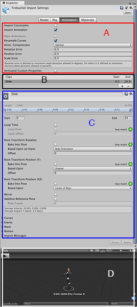
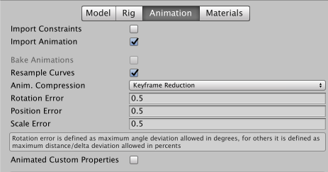
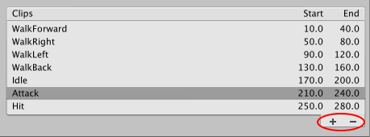
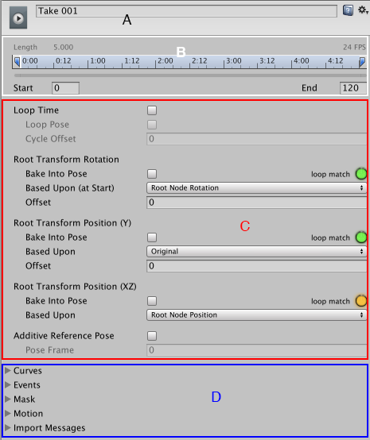
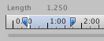
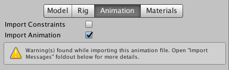
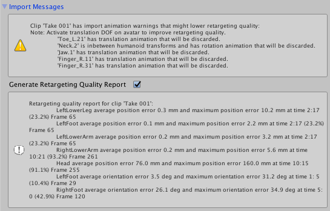
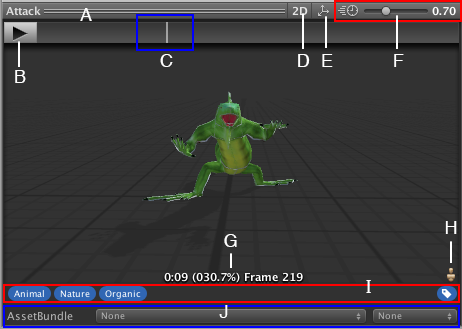

# Animation 选项卡

__动画剪辑__是 Unity 动画的最小构成元素。它们代表了一个单独的运动，例如 RunLeft、Jump 或 Crawl，并且可通过各种方式进行操作和组合，从而产生生动的效果（请参阅[动画状态机（Animation State Machines）](AnimationStateMachines.html)、[Animator Controller](class-AnimatorController.html) 或[混合树（Blend Trees）](class-BlendTree.html)）。
您可以从导入的 FBX 数据中选择动画剪辑。

单击包含动画剪辑的模型时，将显示以下属性：

Inspector 窗口的 __Rig__ 选项卡包含四个区域：

* (A) [特定资源属性](#AssetProperties)。这些设置定义了整个资源的导入选项。
* (B) [剪辑选择列表](#ClipSelectionList)。您可以从此列表中选择任何项目以显示其属性并预览其动画。您也可以[定义新的剪辑](Splittinganimations.html)。
* (C) [特定剪辑属性](#ClipProperties)。这些设置定义了所选__动画剪辑__的导入选项。
* (D) [动画预览](#AnimationPreview)。您可以在此处播放动画并选择特定帧。

 
## 特定于资源的属性

这些属性适用于此资源中定义的所有动画剪辑和约束：

|**_属性：_** ||**_功能：_** |
|:---|:---|:---|
|__Import Constraints__ ||从此资源导入[约束](Constraints.html)。 |
|__Import Animation__ ||从此资源导入动画。  **_注意：_**如果禁用此选项，则会隐藏此页面上的所有其他选项，并且不会导入任何动画。|
|__Bake Animations__ ||烘焙通过反向动力学 (IK) 或模拟 (Simulation) 创建的动画以便推进运动关键帧。  仅可用于 Maya、3ds Max 和 Cinema 4D 文件。 |
|__Resample Curves__ ||将动画曲线重新采样为四元数值，并为动画中的每个帧生成一个新的四元数关键帧。  默认情况下会启用此选项。 仅当原始动画中的关键点之间存在插值问题时，才应禁用此选项来[保留最初创作的动画曲线](AnimationEulerCurveImport.html)。  仅当导入文件包含欧拉曲线时才会显示此选项。|
|__Anim. Compression__||导入动画时要使用的压缩类型。 |
||__Off__|禁用动画压缩。这意味着 Unity 不会在导入时减少关键帧数量，因此可产生最高精度的动画，但性能会降低、文件会更大、运行时内存大小将增加。通常建议不要使用此选项；如果需要更高精度的动画，应启用关键帧减少 (Keyframe Reduction) 功能并减小允许的 __Animation Compression Error__ 值。|
||__Keyframe Reduction__ |导入时减少冗余关键帧。如果选择此选项，则会显示 __Animation Compression Errors__ 选项。这会影响文件大小（运行时内存）以及如何计算曲线。|
||__Keyframe Reduction and Compression__|导入时减少关键帧并在文件中存储动画时压缩关键帧。这仅影响文件大小；运行时内存大小与 __Keyframe Reduction__ 相同。如果选择此选项，则会显示 __Animation Compression Errors__ 选项。|
||__Optimal__ |让 Unity 决定如何进行压缩：通过减少关键帧还是通过使用密集格式。  仅适用于 __Generic__ 和 __Humanoid__ [动画类型](FBXImporter-Rig.html)骨架。 |
| __Animation Compression Errors__ || 仅当启用 __Keyframe Reduction__ 或 __Optimal__ 压缩时可用。 |
||__Rotation Error__|旋转曲线的减少量。该值越小，精度越高。 |
||__Position Error__|位置曲线的减少量。该值越小，精度越高。 |
||__Scale Error__|缩放曲线的减少量。该值越小，精度越高。 |
|__Animated Custom Properties__||导入您指定为自定义用户属性的任何 FBX 属性。  Unity 在导入 FBX 文件时仅支持一小部分属性（例如转换、旋转、缩放和可见性）。但是，您可以借助 [extraUserProperties](../ScriptReference/ModelImporter-extraUserProperties.html) 成员，在导入器脚本中指定标准 FBX 属性（如用户属性）来处理这些属性。在导入期间，Unity 会将所有这些指定属性传递给[资源后处理器 (Asset postprocessor)](../ScriptReference/AssetPostprocessor.OnPostprocessGameObjectWithUserProperties.html)，就像“真实”用户属性一样。 |

 
## 剪辑选择列表

在 __Rig__ 选项卡的此区域中可执行以下任务：

* 从列表中选择一个剪辑以[显示特定于剪辑的属性](#ClipProperties)。
* 在[剪辑预览面板](#AnimationPreview)中播放所选剪辑。
* 使用添加 (`+`) 按钮为此文件[创建新剪辑](Splittinganimations.html)。
* 使用删除 (`-`) 按钮删除所选的剪辑定义。

 
## 特定于剪辑的属性

__Rig__ 选项卡的此区域显示以下特性：

* (A) 所选剪辑的名称（可编辑）
* (B) 动画剪辑时间轴
* (C) 用于控制循环和姿势的剪辑属性
* (D) 这些可展开的部分用于：定义曲线、事件、遮罩和运动根以及查看导入过程产生的消息

您可以为此资源中定义的每个动画剪辑单独设置以下属性：

<!-- not sure about images in tables --> 

|**_属性：_** ||**_功能：_** |
|:---|:---|:---|
|***A 区域（可编辑名称）***|||
| ||源文件中的剪辑，用作此动画剪辑的源。  此属性定义了在 Motionbuilder、Maya 和其他 3D 包中提取的一组动画。Unity 可以将这些内容导入为单个剪辑。您可以[从整个文件或从帧子集创建它们](Splittinganimations.html)。 |
|***B 区域（时间轴特性）***|||
| ||您可以通过在时间轴上拖动起始和结束标记来定义每个剪辑的帧范围。|
|__Start__ ||剪辑的起始帧。|
|__End__ ||剪辑的结束帧。|
|***C 区域（循环和姿势控制）***|||
|__Loop Time__ ||播放动画剪辑并在到达结尾时重新开始。|
||__Loop Pose__ |无缝循环运动。|
||__Cycle Offset__ |循环动画在其他时间开始时的周期偏移。|
|__Root Transform Rotation__ ||| 
|__Bake into Pose__ ||将根旋转烘焙到骨骼移动。禁用此选项将会存储为根运动。| 
|__Based Upon__ ||根旋转的基础。|
||__Original__|保持源文件中的原始旋转。|
||__Root Node Rotation__ |保持上半身朝前。  仅适用于 __Generic__ [动画类型](FBXImporter-Rig.html)。|
||__Body Orientation__ |保持上半身朝前。  仅适用于 __Humanoid__ [动画类型](FBXImporter-Rig.html)。|
|__Offset__ ||根旋转偏移（以度为单位）。|
|__Root Transform Position (Y)__ ||| 
|__Bake into Pose__ ||将垂直根运动烘焙到骨骼移动。禁用此选项将会存储为根运动。| 
|__Based Upon (at Start)__ ||垂直根位置的基础。|
||__Original__ |保持源文件中的垂直位置。|
||__Root Node Position__ |使用垂直根位置。  仅适用于 __Generic__ [动画类型](FBXImporter-Rig.html)。|
||__Center of Mass__ |保持质心与根变换位置对齐。  仅适用于 __Humanoid__ [动画类型](FBXImporter-Rig.html)。|
||__Feet__ |保持双脚与根变换位置对齐。  仅适用于 __Humanoid__ [动画类型](FBXImporter-Rig.html)。|
|__Offset__ ||垂直根位置偏移。|
|__Root Transform Position (XZ)__ ||| 
|__Bake into Pose__ ||将水平根运动烘焙到骨骼移动。禁用此选项将会存储为根运动。| 
|__Based Upon__ ||水平根位置的基础。|
||__Original__ |保持源文件中的水平位置。|
||__Root Node Position__ |使用水平根变换位置。  仅适用于 __Generic__ [动画类型](FBXImporter-Rig.html)。|
||__Center of Mass__ |保持与根变换位置对齐。  仅适用于 __Humanoid__ [动画类型](FBXImporter-Rig.html)。|
|__Offset__ ||水平根位置偏移。|
|__Mirror__ ||在此剪辑中进行左右镜像。  仅当[动画类型 (Animation Type)](FBXImporter-Rig.html) 设置为 __Humanoid__ 时才显示。|
|__Additive Reference Pose__ ||启用此选项可以设置[附加动画层](AnimationLayers.html)基础参考姿势的帧。在时间轴编辑器中可以看到蓝色标记：  |
||__Pose Frame__|输入一个帧编号以用作参考姿势。还可以在时间轴中拖动蓝色标记来更新此值。  仅当启用 __Additive Reference Pose__ 的情况下才可用。| 
|***D 区域（可展开部分）***|||
|__Curves__ ||展开此部分可管理[导入的剪辑上的动画曲线](AnimationCurvesOnImportedClips.html)。|
|__Events__ ||展开此部分可管理[导入的剪辑上的动画事件](animeditor-AnimationEvents.html)。|
|__Mask__ ||展开此部分可管理[对导入剪辑的遮罩](class-AvatarMask.html)。|
|__Motion__ ||展开此部分可管理[根运动节点的选择](AnimationRootMotionNodeOnImportedClips.html)。|
|__Import Messages__ ||展开此部分可查看[有关如何导入动画的详细信息](#ImportMessages)，包括可选的*重定向质量报告 (Retargeting Quality Report)*。|

创建剪辑实质上是定义动画段的起点和终点。为了使这些剪辑循环，应修整这些剪辑，使它们尽可能匹配[所需循环](LoopingAnimationClips.html)的第一帧和最后一帧。

 
## 动画导入警告

如果在动画导入过程中出现任何问题，动画导入检视面板 (Animations Import Inspector) 顶部会显示警告：

这些警告并不一定意味着您的动画未导入或不正常。可能仅表示导入的动画与源动画看起来略有不同。

要查看更多信息，请展开 __Import Messages__ 部分：

在这种情况下，Unity 提供了 __Generate Retargeting Quality Report__ 选项，通过启用该选项可以查看有关重定向问题的更多具体信息。

您可能会看到的其他警告详细信息包括：

- 此文件中的默认骨骼长度与源 Avatar 中的值不同。
- 此文件中的中间骨骼默认旋转与源 Avatar 中的值不同。
- 源 Avatar 层级视图与此模型中的层级视图不匹配。
- 此动画具有将被丢弃的转换动画。
- 人形动画具有将被丢弃的中间变换和旋转。
- 具有将被丢弃的缩放动画。

这些消息表明 Unity 导入动画并将其转换为自己的内部格式时忽略了原始文件中的某些数据。这些警告实质上告诉您重定向的动画可能与源动画不完全匹配。

**注意：**Unity 不支持除**常量 (constant)** 以外的前外推 (pre-extrapolate) 和后外推 (post-extrapolate) 模式（也称为前无限 (pre-infinity) 和后无限 (post-infinity) 模式），因此会在导入时将这些模式转换为**常量**。

 
## 动画预览

__Rig__ 选项卡的预览区域提供以下特性：

* (A) 所选剪辑的名称
* (B) 播放/暂停按钮
* (C) 位于预览时间轴上的播放头（可来回拖动）
* (D) [2D 预览模式](Overview2D.html)按钮（在正交摄像机和透视摄像机之间切换）
* (E) 轴心和质心显示按钮（在显示和隐藏辅助图标之间切换）
* (F) 动画预览速度滑动条（向左移动减速；向右移动加速）
* (G) 播放状态标记（以秒、百分比和帧编号显示播放位置）
* (H) Avatar 选择器（更改要预览该操作的游戏对象）
* (I) __Tag__ 栏，在此处可以定义[标签 (Tags)](Tags.html) 并将其应用于剪辑
* (J) [AssetBundle](AssetBundlesIntro.html) 栏，在此处可以[定义 AssetBundle 和变体](AssetBundles-Workflow.html)

---

*  2018-04-25  Page amended with limited [editorial review](DocumentationEditorialReview.html)

*  2017-12-05  Page amended with no [editorial review](DocumentationEditorialReview.html)

* [2017.2](https://docs.unity3d.com/2017.2/Documentation/Manual/30_search.html?q=newin20172) 中添加了 Materials 选项卡 NewIn20172
