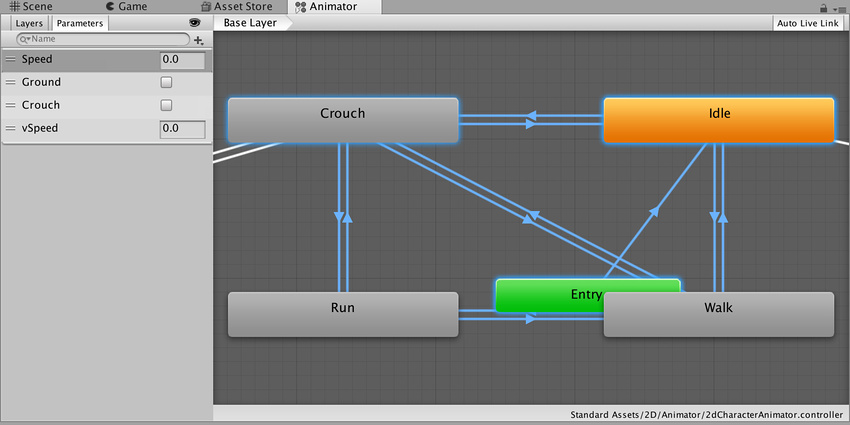
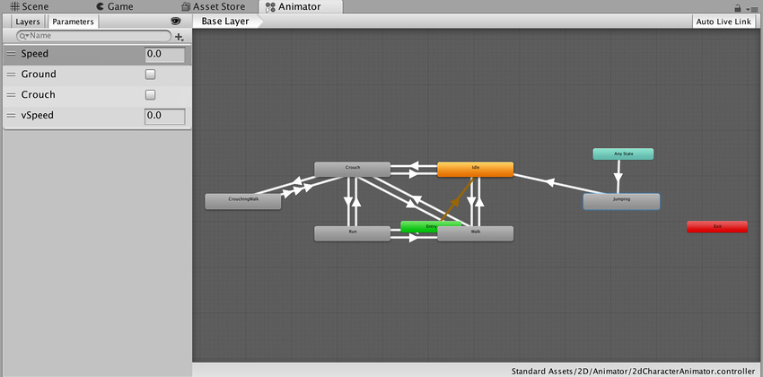
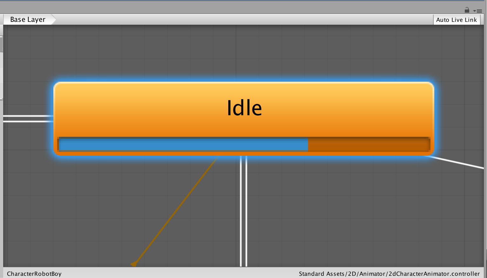

Animator Controller
===================

Animator Controller 允许您为角色或对象安排和维护一组动画剪辑以及关联的动画过渡。在大多数情况下，拥有多个动画并在满足某些游戏条件时在这些动画之间切换是很常见的。例如，只要按下空格键，就可以从行走动画剪辑切换到跳跃动画剪辑。但是，即使您仅有一个动画剪辑，仍需要将其放入 Animator Controller 以便将其用于游戏对象。

Animator Controller 引用其中所用的动画剪辑，使用__状态机__来管理各种动画剪辑和它们之间的过渡；状态机可视为动画剪辑和过渡的一种流程图，或者是在 Unity 中使用可视化编程语言编写的简单程序。可在[此处](AnimationStateMachines.html)找到有关状态机的更多信息。

开始使用 Animation 窗口对游戏对象进行动画化时，或者将动画剪辑附加到游戏对象时，Unity 会自动创建 Animator Controller。

要手动创建 Animator Controller，请右键单击 Project 窗口，然后单击 __Create > Animator Controller__。

##导航

使用鼠标滚轮或类似功能可放大和缩小 Animator Controller 窗口。

要聚焦 Animator Controller 窗口中的某一项，请选择一个或多个状态（单击要选择的状态或在其周围拖动选框），然后按 F 键来放大所选项。

按 A 键可将所有动画状态调整到 Animator Controller 视图中。

Unity 将保存您的选择。按 A 和 F 键可在所选动画状态与整个 Animator Controller 之间切换。

在播放模式期间，Animator 会平移视图，以便始终能看到正在播放的当前状态。Animator Controller 遵循基础层和子状态机的独立缩放因子，而窗口将自动平移以确保活动状态的可见性。

要在播放模式下修改缩放，请遵循以下步骤：

* 在 Animator Controller 窗口中启用 __Auto Live Link__
* 单击 Play 按钮以进入播放模式
* 单击 Pause
* 在 Animator Controller 中，选择要放大的一个或多个状态
* 按 F 键来放大所选项
* 再次单击 Play 按钮以恢复播放模式

请注意，Animator Controller 在激活时会平移到每个状态。

---

* 2017-11-21 Page published with limited [editorial review](DocumentationEditorialReview.html)

* 在 [2017.3](https://docs.unity3d.com/2017.3/Documentation/Manual/30_search.html?q=newin20173) 中添加了 Animator 缩放 NewIn20173
