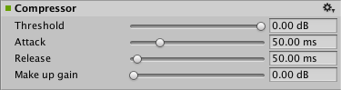

#音频压缩器效果

__音频压缩器效果 (Audio Compressor Effect)__ 通过缩小或“压缩”音频信号的动态范围来降低大声音的音量或放大安静的声音。

##属性

 

|**_属性：_** |**_功能：_** |
|:---|:---|
|__Threshold__ |阈值级别，以 dB 为单位（范围从 0 到 -60dB，默认值为 0dB）。|
|__Attack__ |应用效果的速度，以 ms 为单位（范围从 10.0 到 200.0 ms，默认值为 50.0 ms）。|
|__Release__ |释放效果的速度，以 ms 为单位（范围从 20.0 到 1000.0 ms，默认值为 50.0 ms）。|
|__Make up gain__ |增益补偿级别，以 dB 为单位（范围从 0 到 30dB，默认值为 0dB）。|

