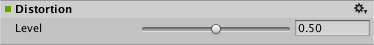

#音频失真效果

__失真效果 (Distortion Effect)__ 可对[混音器](class-AudioMixer.html)组中的声音进行失真处理。

##属性

 

|**_属性：_** |**_功能：_** |
|:---|:---|
|__Distortion__ |失真值。范围从 0.0 到 1.0。默认值为 0.5。|

##详细信息

应用__失真效果__可模拟低质量无线电传输的声音。
