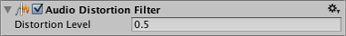

#音频失真滤波器 (Audio Distortion Filter)

__Audio Distortion Filter__ 可将来自[音频源](class-AudioSource.html)的声音或者到达[音频监听器](class-AudioListener.html)的声音进行失真处理。

##属性

 

|**_属性：_** |**_功能：_** |
|:---|:---|
|__Distortion__ |失真值。范围从 0.0 到 1.0。默认值为 0.5。|

##详细信息

应用 __Audio Distortion Filter__ 可模拟低质量无线电传输的声音。
