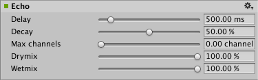

#音频回声效果

__音频回声效果 (Audio Echo Effect)__ 在给定的__延时 (Delay)__ 之后重复声音，并根据__衰减率 (Decay Ratio)__ 衰减重复的声音。

##属性

 

|**_属性：_** |**_功能：_** |
|:---|:---|
|__Delay__ |回声延时，以 ms 为单位。范围从 10 到 5000。默认值为 500。|
|__Decay__ |每次延时的回声衰减。范围从 0 到 100%。100% 表示无衰减，0% 表示完全衰减（例如，简单的 1 行延时）。默认值为 50%。|
|__Max channels__ ||
|__Drymix__ |要传递到输出的原始信号量。范围从 0 到 100%。默认值为 100%。|
|__Wetmix__ |要传递到输出的回声信号量。范围从 0 到 100%。默认值为 100%。|

##详细信息

__Wetmix__ 值决定了滤波信号的幅度，__Drymix__ 决定了未滤波声音输出的幅度。

坚硬的表面会反射声音的传播。例如，使用音频回声滤波器 (Audio Echo Filter) 可使大峡谷效果更加逼真。

