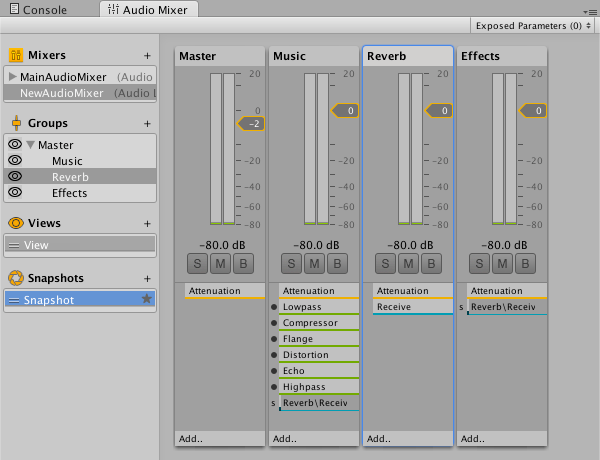

#音频效果

可通过应用__音频效果__来修改[混音器 (Audio Mixer)](class-AudioMixer.html) 组件的输出。这些音效可以过滤声音的频率范围或应用混响和其他效果。

通过将效果组件添加到混音器的相关部分即可应用效果。组件的排序很重要，因为它代表应用于音频源的顺序。例如，在下图中，混音器 (Audio Mixer) 的 Music 部分首先由低通 (Lowpass) 效果修改，然后由压缩器 (Compressor) 效果、边缘 (Flange) 效果等效果进行修改。

 

要更改这些组件和任何其他组件的顺序，请在检视面板中打开上下文菜单，然后选择 _Move Up_ 或 _Move Down_ 命令。启用或禁用效果组件可确定是否应用该组件。

虽然进行了高度优化，但某些滤波器仍然为 CPU 密集型。可在 Audio 选项卡下面的[性能分析器](Profiler.html)中监控音频的 CPU 使用率。

有关具体可用效果类型的详细信息，请参阅本部分的其他页面。
