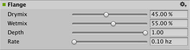

#音频边缘效果

__音频边缘效果 (Audio Flange Effect)__ 通过如下方式产生音频效果：将两个相同的信号混合在一起，一个信号会有很小周期变化的延迟，通常小于 20 毫秒。

##属性

 

|**_属性：_** |**_功能：_** |
|:---|:---|
|__Drymix__ |原始信号的输出百分比。范围从 0.0 到 100.0%。默认值为 45%。|
|__Wetmix__ |要传递到输出的边缘信号的百分比。范围从 0.0 到 100.0%。默认值为 55%。|
|__Depth__ | 范围从 0.01 到 1.0。默认值为 1.0。|
|__Rate__ | 范围从 0.1 到 20 Hz。默认值为 10 Hz。|

