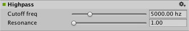

#音频高通效果

__高通效果 (Highpass Effect)__ 传递混音器组的高频率，并对频率低于__截止频率 (Cutoff Frequency)__ 的信号进行截止。

##属性

 

|**_属性：_** |**_功能：_** |
|:---|:---|
|__Cutoff freq__ |高通截止频率，单位为赫兹（范围从 10.0 至 22000.0，默认值为 5000.0）。|
|__Resonance__ |高通共振品质值（范围从 1.0 至 10.0，默认值为 1.0）。|

##详细信息

__Resonance__（Highpass Resonance Quality Factor 的缩写，表示高通共振品质因数）决定了滤波器自共振的衰减程度。高通谐振品质越高表明能量损失速度越慢，即振荡消失得越慢。
