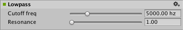

#音频低通效果

__音频低通效果 (Audio Low Pass Effect)__ 传递[混音器](class-AudioMixer.html)组的低频，同时去除高于__截止频率 (Cutoff Frequency)__ 的频率。

##属性

 

|**_属性：_** |**_功能：_** |
|:---|:---|
|__Cutoff freq__ |低通截止频率，单位为赫兹（范围从 10.0 至 22000.0，默认值为 5000.0）。|
|__Resonance__ |低通共振品质值（范围从 1.0 至 10.0，默认值为 1.0）。|

##详细信息

__Resonance__（Lowpass Resonance Quality Factor 的缩写，表示低通共振品质因数）决定了滤波器自共振的衰减程度。低通谐振品质越高表明能量损失速度越慢，即振荡消失得越慢。

