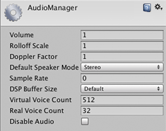

#Audio Manager

__Audio Manager__ 可用于调整场景中播放的所有声音的最大音量。
若要此设置，请选择 __Edit &gt; Project Settings &gt; Audio__。

 

##属性

|**_属性：_** ||**_功能：_** |
|:---|:---|:---|
|__Volume__ ||要播放的所有声音的音量。 |
|__Rolloff Scale__ ||设置基于对数衰减的音频源的全局衰减系数（请参阅[音频源](class-AudioSource.html)）。值越高，音量衰减得越快；反过来，值越低，衰减越慢（值 1 将模拟“真实世界”）。|
|__Doppler Factor__ ||多普勒效应的听觉影响。为零时，此功能关闭。值为 1 表示对于快速移动的物体应该能听得见声音。 |
|__Default Speaker Mode__ ||定义项目的默认扬声器模式。默认值为 2，表示立体声扬声器设置（有关模式列表，请参阅脚本 API 参考中的 [AudioSpeakerMode](../ScriptReference/AudioSpeakerMode.html)）。|
|__Sample Rate__||输出采样率。如果设置为 0，将使用系统的采样率。另外请注意，这仅作为参考，因为只有部分平台允许更改此设置，例如 iOS 或 Android。 |
|__DSP Buffer Size__||可以设置 DSP 缓冲区的大小来优化延迟或性能|
||__Default__|默认缓冲区大小|
||__Best Latency__|在牺牲性能的情况下降低延迟|
||__Good Latency__|在延迟和性能之间取得平衡|
||__Best Performance__|在牺牲延迟的情况下提高性能|
|__Virtual Voice Count__||音频系统管理的虚拟语音数。该值应始终大于游戏所播放的语音数量。否则控制台中将显示警告。 |
|__Real Voice Count__||可以同时播放的真实语音的数量。每一帧都会选取最响亮的语音。 |
|__Disable Audio__ ||在独立构建中停用音频系统。请注意，这也会影响 MovieTexture 的音频。在 Editor 中，音频系统仍处于打开状态，并会支持预览音频剪辑，但不支持音频源 (AudioSource)。为了模拟独立构建的行为，不会处理 Play 调用和 playOnAwake 调用。 |

##详细信息

如果想使用多普勒效应，请将 __Doppler Factor__ 设置为 1。然后调整 __Speed of Sound__ 和 __Doppler Factor__，直到满意为止。
可以在运行时通过脚本从应用程序中更改扬声器模式。请参阅[音频设置](../ScriptReference/AudioSettings.html)。
