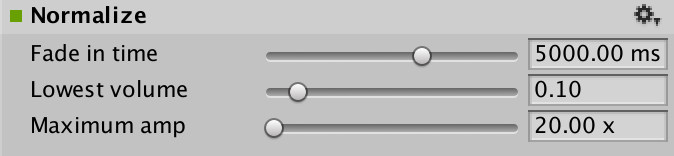

#音频标准化效果

__音频标准化效果 (Audio Normalize Effect)__ 将对音频流应用恒定的增益，从而将平均或峰值幅度提升到目标级别。

##属性

 

|**_属性：_** |**_功能：_** |
|:---|:---|
|__Fade in time__ |效果的淡入时间，以毫秒为单位（范围从 0 到 20000.0，默认值为 5000.0 毫秒）。|
|__Lowest volume__ |（范围从 0.0 到 1.0，默认值为 0.10）。|
|__Maximum amp__ |最大幅度（范围从 0.0 到 100000.0，默认值为 20 x）。|

