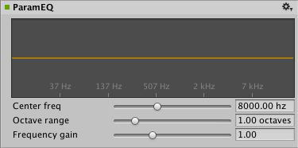
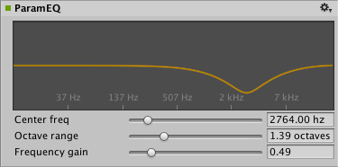

#音频参数均衡器效果

__音频参数均衡器效果 (Audio Param EQ Effect)__ 用于改变使用线性滤波器的音频系统的频率响应。

##属性

 

|**_属性：_** |**_功能：_** |
|:---|:---|
|__Center freq__ |应用增益的频率，单位为赫兹（范围从 20.0 到 22000.0，默认值为 8000.0 Hz）。|
|__Octave Range__ |应用增益的八度音阶数（在中心频率上的中心位置）（范围从 0.20 到 5.00，默认值为 1.0 八度音阶）。|
|__Frequency Gain__ |应用的增益（范围从 0.05 至 3.00，默认值为 1.00，表示不应用增益）。|

##详细信息

该图显示了要应用的增益对于音频输出的频率范围的影响。

 
