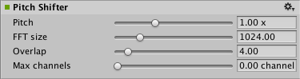

#音频变调器效果

__音频变调器效果 (Audio Pitch Shifter Effect)__ 用于将信号的音调升高或降低。

##属性

 

|**_属性：_** |**_功能：_** |
|:---|:---|
|__Pitch__ |音调乘数（范围从 0.5 x 到 2.0 x，默认值为 1.0 x）。|
|__FFT Size__ | （范围从 256.0 到 4096.0，默认值为 1024.0）。|
|__Overlap__ | （范围从 1 到 32，默认值为 4）。|
|__Max channels__ | 声道最大数量（范围从 0 到 16，默认值为 0 声道）。|

