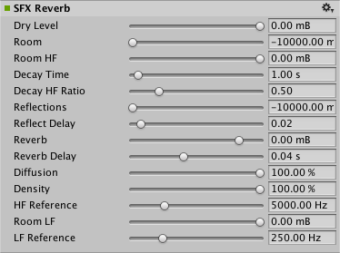

#音频 SFX 混响效果

__SFX 混响效果 (SFX Reverb Effect)__ 将获取[混音器](class-AudioMixer.html)组的输出并对其进行失真处理以创建自定义的混响效果。

##属性

 

|**_属性：_** |**_功能：_** |
|:---|:---|
|__Dry Level__ |输出中的干信号的混合等级，以 mB 为单位。范围从 -10000.0 到 0.0。默认值为 0 mB。|
|__Room__ |低频下的房间效果等级，以 mB 为单位。范围从 -10000.0 到 0.0。默认值为 -10000.0 mB。|
|__Room HF__ |房间效果高频等级，以 mB 为单位。范围从 -10000.0 到 0.0。默认值为 0.0 mB。|
|__Decay Time__ |低频下的混响衰减时间，以秒为单位。范围从 0.1 到 20.0。默认值为 1.0。|
|__Decay HF Ratio__ |衰减高频比率：高频到低频衰减时间比率。范围从 0.1 到 2.0。默认值为 0.5。|
|__Reflections__ |相对于房间效果的早期反射等级，以 mB 为单位。范围从 -10000.0 到 1000.0。默认值为 -10000.0 mB。|
|__Reflect Delay__ |相对于房间效果的早期反射延时时间，以 mB 为单位。范围从 -10000.0 到 2000.0。默认值为 0.02。|
|__Reverb__ |相对于房间效果的晚期混响等级，以 mB 为单位。范围从 -10000.0 到 2000.0。默认值为 0.0 mB。|
|__Reverb Delay__ |相对于第一次反射的晚期混响延时时间，以秒为单位。范围从 0.0 到 0.1。默认值为 0.04 s。|
|__Diffusion__ |混响扩散（回声密度），以百分比为单位。范围从 0.0 到 100.0。默认值为 100.0%。|
|__Density__ |混响密度（模态密度），以百分比为单位。范围从 0.0 到 100.0。默认值为 100.0%。|
|__HFReference__ |参考高频，以 Hz 为单位。范围从 20.0 到 20000.0。默认值为 5000.0 Hz。|
|__Room LF__ |房间效果低频等级，以 mB 为单位。范围从 -10000.0 到 0.0。默认值为 0.0 mB。|
|__LFReference__ |参考低频，以 Hz 为单位。范围从 20.0 到 1000.0。默认值为 250.0 Hz。|

