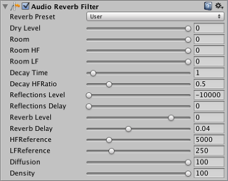

#音频混响滤波器 (Audio Reverb Filter)

__Audio Reverb Filter__ 将获取[音频剪辑](class-AudioClip.html)并对其进行失真处理以创建自定义的混响效果。

##属性

 

|**_属性：_** |**_功能：_** |
|:---|:---|
|__Reverb Preset__ |自定义的混响预设值，选择 User 可创建自定义混响。|
|__Dry Level__ |输出中的干信号的混合等级，以 mB 为单位。范围从 -10000.0 到 0.0。默认值为 0。|
|__Room__ |低频下的房间效果等级，以 mB 为单位。范围从 -10000.0 到 0.0。默认值为 0.0。|
|__Room HF__ |房间效果高频等级，以 mB 为单位。范围从 -10000.0 到 0.0。默认值为 0.0。|
|__Room LF__ |房间效果低频等级，以 mB 为单位。范围从 -10000.0 到 0.0。默认值为 0.0。|
|__Decay Time__ |低频下的混响衰减时间，以秒为单位。范围从 0.1 到 20.0。默认值为 1.0。|
|__Decay HFRatio__ |衰减高频比率：高频到低频衰减时间比率。范围从 0.1 到 2.0。默认值为 0.5。|
|__Reflections Level__ |相对于房间效果的早期反射等级，以 mB 为单位。范围从 -10000.0 到 1000.0。默认值为 -10000.0。|
|__Reflections Delay__ |相对于房间效果的早期反射延时时间，以 mB 为单位。范围从 0 到 0.3。默认值为 0.0。|
|__Reverb Level__ |相对于房间效果的晚期混响等级，以 mB 为单位。范围从 -10000.0 到 2000.0。默认值为 0.0。|
|__Reverb Delay__ |相对于第一次反射的晚期混响延时时间，以秒为单位。范围从 0.0 到 0.1。默认值为 0.04。|
|__HFReference__ |参考高频，以 Hz 为单位。范围从 1000.0 到 20000.0。默认值为 5000.0。|
|__LFReference__ |参考低频，以 Hz 为单位。范围从 20.0 到 1000.0。默认值为 250.0。|
|__Diffusion__ |混响扩散（回声密度），以百分比为单位。范围从 0.0 到 100.0。默认值为 100.0。|
|__Density__ |混响密度（模态密度），以百分比为单位。范围从 0.0 到 100.0。默认值为 100.0。|

**注意：**仅当 __Reverb Preset__ 设置为 __User__ 时，才能修改这些值，否则这些值将显示为灰色，并且每个预设都为默认值。

