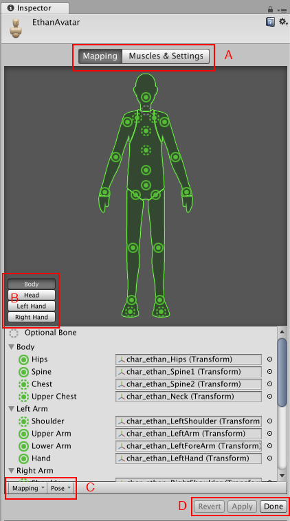
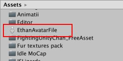

# Avatar Mapping 选项卡

保存场景后，__Inspector__ 内将显示 __Avatar Mapping__ 选项卡，其中显示 Unity 的骨骼映射：

* (A) 通过这些按钮在 __Mapping__ 和 __Muscles &amp; Settings__ 选项卡之间进行切换。在选项卡之间切换之前，必须对所做的更改执行 __Apply__ 或 __Revert__ 操作。
* (B) 通过这些按钮在 Avatar 的部位之间进行切换：__Body__、__Head__、__Left Hand__ 和 __Right Hand__。
* (C) 这些菜单提供各种 __Mapping__ 和 __Pose__ 工具来帮助您将骨骼结构映射到 Avatar。
* (D) 通过这些按钮接受所做的更改 (__Accept__)、放弃更改 (__Revert__) 以及离开 Avatar 窗口 (__Done__)。在离开 __Avatar__ 窗口之前，必须对所做的更改执行 __Apply__ 或 __Revert__ 操作。

Avatar Mapping（Avatar 映射）指示哪些骨骼是必需的（实线圆圈）和哪些骨骼是可选的（虚线圆圈）。Unity 可自动插入可选的骨骼移动。

 
## 保存和重用 Avatar 数据（人体模板 (Human Template) 文件）

您可以将骨架中的骨骼映射保存到磁盘上的 Avatar 作为[人体模板（Human Template）文件](class-HumanTemplate.html)（扩展名为 `*.ht`）。您可以对任何角色重用此映射。例如，您希望通过源代码控制 Avatar 映射，并提交基于文本的文件；或者希望使用自己的自定义工具来解析文件。

要将 Avatar 数据保存到人体模板文件，请从 __Avatar__ 窗口底部的 __Mapping__ 下拉菜单中选择 __Save__。

Unity 将显示一个对话框，可在其中选择要保存的文件的名称和位置。

 

要加载先前创建的人体模板文件，请选择 __Mapping__ &gt; __Load__，然后选择要加载的文件。

## 使用 Avatar 遮罩

有时，将动画限制为特定的身体部位会很有用。例如，在一个行走动画中，角色可能会挥动他们的手臂，但如果他们拿起火炬，他们应该将火炬举起来投光。您可以使用 __Avatar 身体遮罩 (Avatar Body Mask)__ 来指定应将动画限制在角色的哪些部位。请参阅有关 [Avatar 遮罩](class-AvatarMask.html)的文档以了解更多详细信息。

---

*  2018-04-25  Page amended with limited [editorial review](DocumentationEditorialReview.html)

